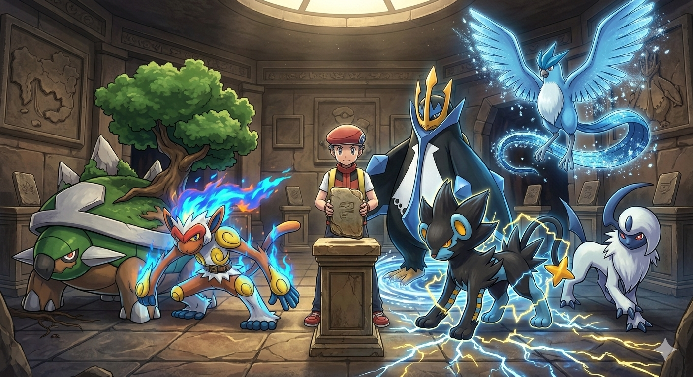
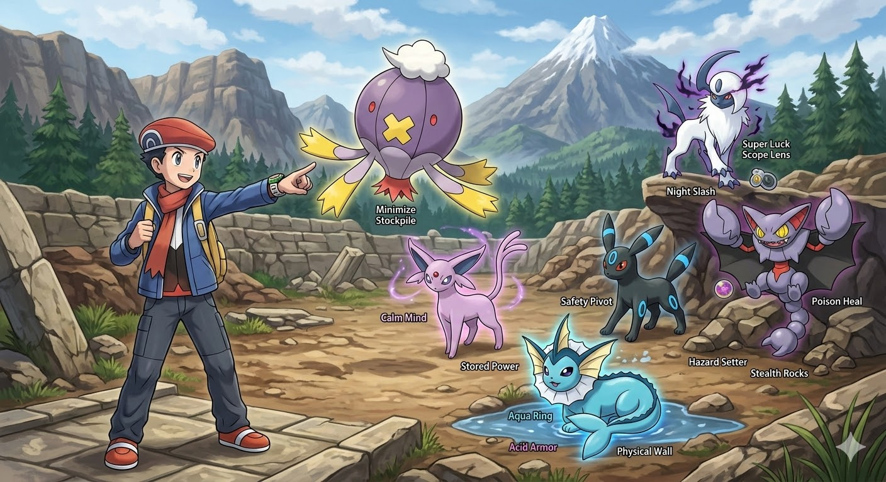

# Shining Pearl Roster

**Back to Main:** [https://phuchduong.github.io/MoogleSaveBook/](https://phuchduong.github.io/MoogleSaveBook/)

**Website:** [https://phuchduong.github.io/MoogleSaveBook/pokemon-bdsp-baton/](https://phuchduong.github.io/MoogleSaveBook/pokemon-bdsp/)

**Table of Contents**
* [Sinnoh Starter Trio Team](#%EF%B8%8F-sinnoh-starter-trio)
* [Baton Pass Team](#%EF%B8%8F-baton-pass-team)
* [Other Considerations](#other-considerations)

---

## 🛡️ Sinnoh Starter Trio

**Marriland Team Code:** `Py5qgCySphCvGq8CM1r3wp7C6qCCCg7WyCh0CCC2G4hC6gCCCQ6k2CDhkjrCDQsjWCDX12t93153ggVqGRC`

**Marriland Link:** [View Team on Marriland](https://marriland.com/tools/team-builder/gen-8/Py5qgCySphCvGq8CM1r3wp7C6qCCCg7WyCh0CCC2G4hC6gCCCQ6k2CDhkjrCDQsjWCDX12t93153ggVqGRC/)

### 📋 Strategy Overview
This team is built around a Sinnoh Starter Core, utilizing the combined bulk and coverage of Torterra, Infernape, and Empoleon to dominate any matchup. The strategy focuses on Intimidate-cycling with Luxray and high-crit pressure from Absol to break through physical walls, while Articuno provides essential aerial utility and sustainability via Roost and Reflect.

### 1. [Torterra](https://pokemondb.net/pokedex/Torterra/moves/8) (The Lead Engine)
* **Role:** Physical Tank & Ground Coverage
* **Ability:** Overgrow
* **Nature:** Adamant (+Attack, -SpAtk)
* **Item:** Leftovers / Big Root
* **Moveset:**
    * `Razor Leaf` / `Wood Hammer` (High-power STAB)
    * `Earthquake` (Main Ground STAB)
    * `Leech Seed` / `Synthesis`
    * `Crunch` / `Stealth Rock`

### 2. [Infernape](https://pokemondb.net/pokedex/Infernape/moves/8) (Mixed Sweeper)
* **Role:** Fast Wall-Breaker
* **Ability:** Blaze
* **Nature:** Naive (+Speed, -SpDef)
* **Item:** Expert Belt
* **Moveset:**
    * `Flare Blitz` (Physical Fire STAB)
    * `Close Combat` (High-power Fighting STAB)
    * `Power-Up Punch` (Setup move to boost Attack)
    * `U-turn` / `Mach Punch` (Priority or Pivot)

### 3. [Empoleon](https://pokemondb.net/pokedex/Empoleon/moves/8) (🛡️ Special Tank / Defensive Pivot)
* **Role:** Special Attacker & Defensive Pivot
* **Ability:** Torrent
* **Nature:** Modest (+SpAtk, -Attack)
* **Item:** Mystic Water / Petaya Berry
* **Moveset:**
    * `Surf` / `Waterfall`
    * `Metal Claw` / `Flash Cannon` (Steel STAB)
    * `Drill Peck` / `Ice Beam`
    * `Swords Dance` / `Whirlpool`

### 4. [Luxray](https://pokemondb.net/pokedex/Luxray/moves/8) (The Safety Pivot)
* **Role:** Intimidate Pivot
* **Ability:** Intimidate (Lowers opponent's Attack)
* **Nature:** Jolly (+Speed, -SpAtk)
* **Item:** Muscle Band
* **Moveset:**
    * `Wild Charge` (Primary Electric STAB)
    * `Volt Switch` (Pivot out after Intimidate)
    * `Crunch` (Dark Coverage) / `Thunder Wave`
    * `Thief` (Farming)

### 5. [Absol](https://pokemondb.net/pokedex/Absol/moves/8) (Sweeper & Catcher)
* **Role:** Physical Glass Cannon
* **Ability:** Super Luck
* **Nature:** Adamant (+Attack, -SpAtk)
* **Item:** Scope Lens
* **Moveset:**
    * `Night Slash` (High Crit Dark STAB)
    * `Mean Look` / `Slash` / `Thief`
    * `Swords Dance` (Attack Setup) / `Play Rough` / `Thunder Wave`
    * `False Swipe` / `Focus Energy` / `Taunt`

### 6. [Articuno](https://pokemondb.net/pokedex/articuno/moves/8) (The Defensive Utility)
* **Role:** Aerial Support & Sustainability
* **Ability:** Pressure
* **Nature:** Calm (+SpDef, -Atk) / Timid (+Speed, -Atk)
* **Item:** Leftovers / Never-Melt Ice
* **Moveset:**
    * `Reflect` / `Mind Reader` / `Hail` / `Rain Dance`
    * `Roost`
    * `Ancient Power` / `Sheer Cold` / `Hurricane`
    * `Freeze-Dry` / `Ice Beam` / `Tailwind` / `Agility` / `Double Team` / `Roar` / `Water Pulse` / `Protect`

---

## 🛡️ Baton Pass Team

**Marriland Team Code:** `P11Wh2h7RxC15g13B74M1r9xQgC4pN6C9x93Ch7VfC9xWjCRy90C9x7gC7zscC9xhNC3wwzC9x5NChk9NCX12t93153ggVqGRC`

**Marriland Link:** [View Team on Marriland](https://marriland.com/tools/team-builder/gen-8/P11Wh2h7RxC15g13B74M1r9xQgC4pN6C9x93Ch7VfC9xWjCRy90C9x7gC7zscC9xhNC3wwzC9x5NChk9NCX12t93153ggVqGRC/)

### 📋 Strategy Overview
This team is built around a **Baton Pass chain**. The goal is to accumulate Evasion, Defense, and Healing buffs on defensive pivots before passing them to a final sweeper. With **Magic Bounce** protection and **Poison Heal** sustainability, this team is designed to dismantle the Sinnoh Elite Four.

**🕹️ Execution Guide**
1.  **Opening:** Lead with **Drifblim** against slow leads (like Spiritomb). Maximize Evasion.
2.  **Sustainability:** Pass to **Vaporeon** for Aqua Ring.
3.  **Hazard Control:** Use **Gliscor** to set Stealth Rocks to ensure Cynthia's Garchomp cannot survive on a Focus Sash.
4.  **The Sweep:** Pass to **Espeon** for Stored Power (Special) or **Absol** for Night Slash (Physical).

### 1. [Drifblim](https://pokemondb.net/pokedex/drifblim/moves/8) (The Lead Engine)
* **Role:** Evasion & Speed Setup
* **Ability:** Unburden
* **Nature:** Timid (+Speed, -Attack)
* **Item:** Sitrus Berry
* **Moveset:**
    * `Baton Pass`
    * `Minimize` (Maxes Evasion)
    * `Stockpile` (Boosts Def/SpDef)
    * `Strength Sap` (Healing + Attack Debuff)

### 2. [Vaporeon](https://pokemondb.net/pokedex/vaporeon/moves/8) (The Physical Wall)
* **Role:** Defense & Passive Healing
* **Ability:** Water Absorb
* **Nature:** Bold (+Defense, -Attack)
* **Item:** Leftovers
* **Moveset:**
    * `Baton Pass`
    * `Acid Armor` (+2 Defense)
    * `Aqua Ring` (Transferable Healing)
    * `Scald` (STAB + Burn Chance)

### 3. [Espeon](https://pokemondb.net/pokedex/espeon/moves/8) (The Magic Shield)
* **Role:** Anti-Status & Special Sweeper
* **Ability:** Magic Bounce (Reflects Taunt/Roar)
* **Nature:** Timid (+Speed, -Attack)
* **Item:** Focus Sash
* **Moveset:**
    * `Baton Pass`
    * `Calm Mind` (+SpAtk/SpDef)
    * `Substitute` (Transferable Shield)
    * `Stored Power` (Massive Stat-based Damage)

### 4. [Umbreon](https://pokemondb.net/pokedex/umbreon/moves/8) (The Safety Pivot)
* **Role:** Mixed Wall & Stall
* **Ability:** Inner Focus
* **Nature:** Calm (+SpDef, -Attack)
* **Item:** Mental Herb
* **Moveset:**
    * `Baton Pass`
    * `Toxic` (Status Chipping)
    * `Moonlight` (Reliable Recovery)
    * `Protect` (Scouting/Stall)

### 5. [Gliscor](https://pokemondb.net/pokedex/gliscor/moves/8) (The Hazard Setter)
* **Role:** Physical Tank & Focus Sash Breaker
* **Ability:** Poison Heal
* **Nature:** Jolly (+Speed, -SpAtk)
* **Item:** Toxic Orb
* **Moveset:**
    * `Baton Pass`
    * `Stealth Rock` (Field Hazard)
    * `Earthquake` (Physical STAB)
    * `Agility` / `Roost` (Instant Recovery) / `Sandstorm` / `Swords Dance` / `Acrobatics` / `Taunt`

### 6. [Absol](https://pokemondb.net/pokedex/absol/moves/8) (The Physical Finisher)
* **Role:** Critical Hit Sweeper
* **Ability:** Super Luck
* **Nature:** Adamant (+Attack, -SpAtk)
* **Item:** Scope Lens
* **Moveset:**
    * `Baton Pass`
    * `Night Slash` (High Crit Dark STAB)
    * `Swords Dance` (Attack Scaling)
    * `False Swipe` / `Thief` / `Play Rough` / `Zen Headbutt` / `Megahorn` / `Stone Edge` / `X-Scissor` / `Shadow Claw` / `Iron Tail`

### 7. [Togekiss](https://pokemondb.net/pokedex/togekiss/moves/8) (The Physical Finisher)
* **Role:** Status Disruptor & Mixed Sweeper
* **Ability:** Serene Grace
* **Nature:** (+Speed, -Attack) — Crucial for outspeeding enemies to get the flinch.
* **Item:** Leftovers or Kings Rock (for extra flinch chance)
* **Moveset:**
    * `Baton Pass`
    * `Air Slash` (60% Flinch chance; the core of the build.)
    * `Tri Attack` (40% Status chance (Burn/Freeze/Paralyze).)
    * `Dazzling Gleam` / `Water Pulse` / `Ancient Power` / `Nasty Plot` / `Stored Power` / `Protect` / `Roost`

---

## Other Considerations
* [Mamoswine](https://pokemondb.net/pokedex/mamoswine/moves/8)
    * `Stealth Rock`
    * `Earthquake`
    * `Icicle Crash`
    * `Ice Shard`
* [Venusaur](https://pokemondb.net/pokedex/venusaur/moves/8)
    * `Toxic`
    * `Leech Seed`
    * `Giga Drain`
    * `Synthesis` / `Substitute` / `Sleep Powder`
* [Glaceon](https://pokemondb.net/pokedex/glaceon/moves/8)
    * `Baton Pass`
    * `Blizzard`
    * `Hail` (Stack with abilities Snow Cloak or Ice Body)
    * `Ice Beam` / `Ice Shard` / `Freeze-Dry`
* [Leafeon](https://pokemondb.net/pokedex/leafeon/moves/8)
    * `Baton Pass`
    * `Sword Stance`
    * `Leaf Blade`
    * `Leech Seed` / `Synthesis` / `Sunny Day` / `Iron Tail` / `Dig` / `Aerial Ace` / `X-Scissor`
* [Palkia](https://pokemondb.net/pokedex/palkia/moves/8)
    * `Aqua Ring`
    * `Surf`
    * `Spacial Rend`
    * `Roar` / `Ancient Power` / `Aura Sphere` / `Earth Power` / `Power Gem`
* [Articuno](https://pokemondb.net/pokedex/articuno/moves/8)
    * `Mind Reader` / `Hail` / `Rain Dance`
    * `Roost`
    * `Sheer Cold` / `Hurricane`
    * `Freeze-Dry` / `Ice Beam` / `Tailwind` / `Reflect` / `Agility` / `Double Team` / `Roar` / `Water Pulse` / `Protect`
* [Registeel](https://pokemondb.net/pokedex/registeel/moves/8)
    * `Iron Defense`
    * `Amnesia`
    * `Earthquake` / `Flash Cannon`
    * `Ancient Power` / `Charge Beam` / `Stealth Rock` / `Thunder Wave` / `Rock Polish` / `Sandstorm ` / `Protect`
* [Regice](https://pokemondb.net/pokedex/Regice/moves/8)
    * `Ice Beam` / `Blizzard`
    * `Amnesia`
    * `Charge Beam` / `Thunder`
    * `Ancient Power` / `Thunderbolt` / `Rain Dance` / `Thunder Wave` / `Rock Polish` / `Hail ` / `Protect` / `Substitute` / `Flash Cannon`
* [Metagross](https://pokemondb.net/pokedex/metagross/moves/8)
    * `Meteor Mash` (Primary STAB / Atk scaling)
    * `Zen Headbutt` (Secondary STAB)
    * `Stealth Rock` (Hazard Support)
    * `Magnet Rise` / `Iron Defense` / `Agility` / `Light Screen` / `Earthquake` / `Protect` / `Substitute` / `Brick Break` / `Reflect`

## 👤 Author
**Phuc H Duong**
* **GitHub:** [@phuchduong](https://github.com/phuchduong)
* **LinkedIn:** [in/phuchduong](https://www.linkedin.com/in/phuchduong/)
