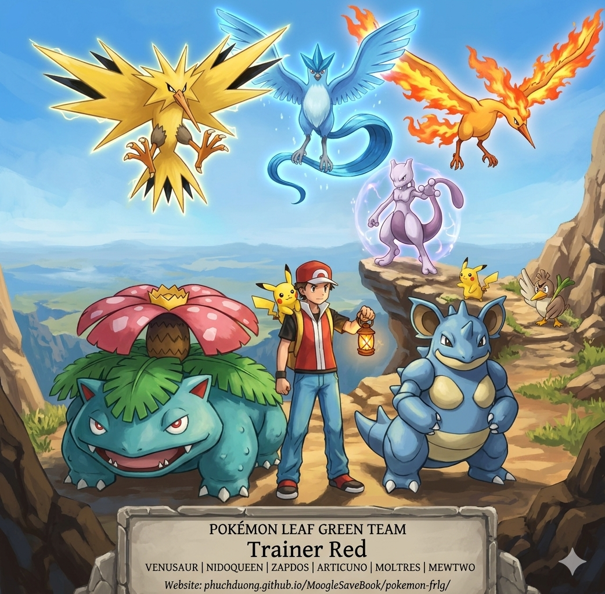
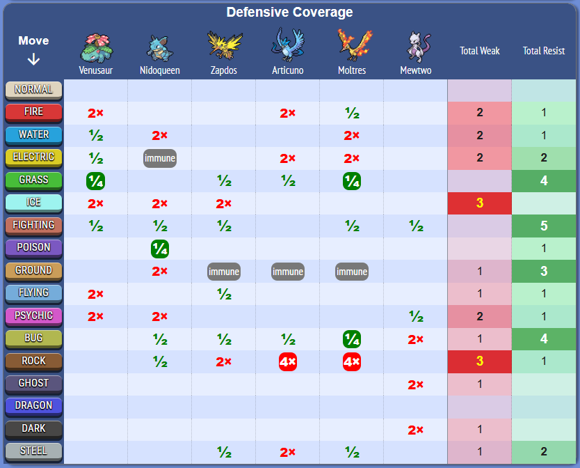
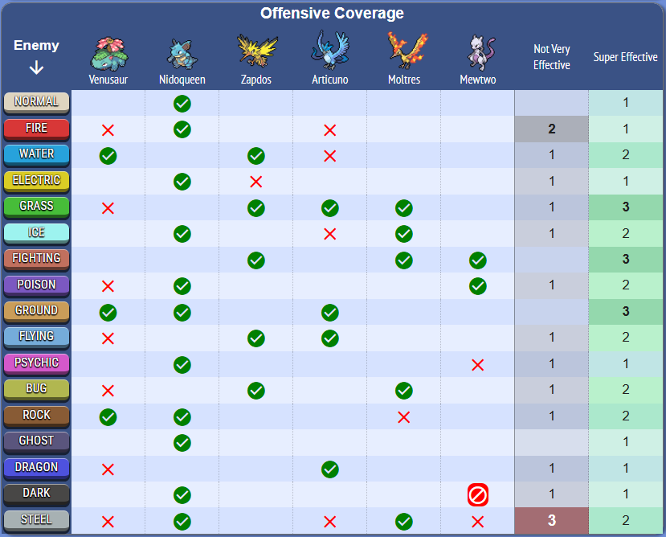

# Pokémon Leaf Green Team

**Back to Main:** [https://phuchduong.github.io/MoogleSaveBook/](https://phuchduong.github.io/MoogleSaveBook/)

**Website:** [https://phuchduong.github.io/MoogleSaveBook/pokemon-frlg/](https://phuchduong.github.io/MoogleSaveBook/pokemon-frlg/)

**Marriland Link  & Code:** [P9G7CCcqdsCctjqCM1r5mCCCD400kC1xkpC3qddCD1mCCCD2brQCD2mCCCD](https://marriland.com/tools/team-builder/gen-3/P9G7CCcqdsCctjqCM1r5mCCCD400kC1xkpC3qddCD1mCCCD2brQCD2mCCCD/)

---

## 🛡️ The Roster

### 1. Venusaur (The Leech Seed Tank)
* **Role:** Bulky Support & Hazard Control
* **Ability:** Overgrow
* **Nature:** Bold (+Defense, -Attack) or Calm (+SpDef, -Attack)
* **Moveset:**
    * `Razor Leaf` / `Giga Drain` (STAB)
    * `Leech Seed` (Passive recovery)
    * `Sleep Powder` (Disables threats)
    * `Sludge Bomb` (Poison STAB)

### 2. Nidoqueen (The Versatile Wall)
* **Role:** Mixed Attacker & Pivot
* **Ability:** Poison Point
* **Nature:** Relaxed (+Defense, -Speed) or Naughty (+Attack, -SpDef)
* **Moveset:**
    * `Earthquake` (Primary STAB)
    * `Surf` (Coverage for Fire/Ground)
    * `Superpower` (High damage Fighting coverage)
    * `Bite` (Flinch chance for Psychic/Ghost types)

### 3. Zapdos (The Special Sweeper)
* **Role:** Fast Special Attacker
* **Ability:** Pressure
* **Nature:** Modest (+SpAtk, -Attack) or Timid (+Speed, -Attack)
* **Moveset:**
    * `Thunderbolt` (Essential high-power STAB)
    * `Drill Peck` (Physical Flying STAB)
    * `Thunder Wave` (Speed control)
    * `Light Screen` / `Steel Wing` (Utility or Coverage)

### 4. Articuno (The Defensive Stall)
* **Role:** Special Wall & Precision Killer
* **Ability:** Pressure
* **Nature:** Calm (+SpDef, -Attack)
* **Moveset:**
    * `Ice Beam` (Reliable Ice STAB)
    * `Mind Reader` (Guarantees next hit)
    * `Sheer Cold` (Guaranteed 1-hit KO combo with Mind Reader)
    * `Fly` / `Reflect`

### 5. Moltres (The Fire Bird)
* **Role:** Special Glass Cannon
* **Ability:** Pressure
* **Nature:** Modest (+SpAtk, -Attack)
* **Moveset:**
    * `Flamethrower` (Reliable Fire STAB)
    * `Wing Attack` / `Sky Attack` (Flying STAB)
    * `Sunny Day` (Boosts Fire damage)
    * `Fire Blast` (Raw power)

### 6. Mewtwo (The Ultimate Weapon)
* **Role:** Legendary Special Sweeper (Post-Game)
* **Ability:** Pressure
* **Nature:** Timid (+Speed, -Attack)
* **Moveset:**
    * `Psychic` (Massive STAB)
    * `Thunderbolt` / `Ice Beam` (Elemental coverage)
    * `Recover` (Sustainability)
    * `Calm Mind` (Boosts to unstoppable levels)

---

## 📊 Type Coverage Analysis

---

## 🛠️ HM Utilities

* **Pikachu:** `Strength`, `Flash`, `Rock Smash`
* **Farfetch'd:** `Cut`, `Fly`

---

## 🛡️ Elite Four & Champion Matchup Table

> **Note:** Mewtwo is excluded as it is obtained after the Elite Four.

| Opponent Pokémon | Best Counter | Recommended Move | Avoid (Super Effective Enemy Moves) |
| :--- | :--- | :--- | :--- |
| **Lorelei (Ice/Water)** | | | |
| Dewgong | **Zapdos** | `Thunderbolt` | `Ice Beam` |
| Cloyster | **Zapdos** | `Thunderbolt` | None |
| Slowbro | **Zapdos** | `Thunderbolt` | `Ice Beam` |
| Jynx | **Moltres** | `Flamethrower` | None |
| Lapras | **Zapdos** | `Thunderbolt` | `Ice Beam` |
| **Bruno (Fighting/Rock)** | | | |
| Onix (Lv. 51) | **Venusaur** | `Giga Drain` | None |
| Hitmonchan | **Zapdos** | `Drill Peck` | `Rock Tomb` |
| Hitmonlee | **Articuno** | `Ice Beam` | None |
| Onix (Lv. 54) | **Venusaur** | `Giga Drain` | None |
| Machamp | **Zapdos** | `Drill Peck` | `Rock Tomb` |
| **Agatha (Ghost/Poison)** | | | |
| Gengar (Lv. 54) | **Nidoqueen** | `Earthquake` | None |
| Golbat | **Zapdos** | `Thunderbolt` | None |
| Haunter | **Nidoqueen** | `Earthquake` | `Dream Eater` |
| Arbok | **Nidoqueen** | `Earthquake` | None |
| Gengar (Lv. 58) | **Nidoqueen** | `Earthquake` | None |
| **Lance (Dragon)** | | | |
| Gyarados | **Zapdos** | `Thunderbolt` | None |
| Dragonair (x2) | **Articuno** | `Ice Beam` | None |
| Aerodactyl | **Articuno** | `Ice Beam` | `AncientPower` (4x) |
| Dragonite | **Articuno** | `Ice Beam` | None |
| **Champion Blue** | | | |
| Pidgeot | **Zapdos** | `Thunderbolt` | None |
| Alakazam | **Nidoqueen** | `Bite` | `Psychic` |
| Rhydon | **Venusaur** | `Razor Leaf` | None |
| Exeggutor | **Moltres** | `Flamethrower` | None |
| Gyarados | **Zapdos** | `Thunderbolt` | None |
| Charizard | **Zapdos** | `Thunderbolt` | None |
