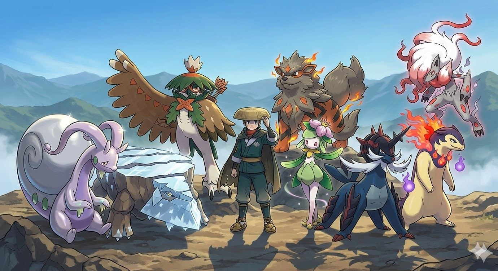

# 📱 Pokémon Legends: Arceus Roster

**Back to Main:** [https://phuchduong.github.io/MoogleSaveBook/](https://phuchduong.github.io/MoogleSaveBook/)

**Website:** [https://phuchduong.github.io/MoogleSaveBook/pokemon-la/](https://phuchduong.github.io/MoogleSaveBook/pokemon-la/)

---

## ⚔️ Battle Roster

#### [Hisuian Goodra](https://pokemondb.net/pokedex/goodra/moves/8)
* **Type:** ⚙️ Steel ⚙️ / 🐲 Dragon 🐲
* **Weak To:** 🥊 Fighting, ⛰️ Ground
* **Nature:** Calm (+Sp. Def, -Attack)
* **Moveset:**
    * `Acid Armor` < `Shelter` (Signature Move / Defensive Buff)
    * `Iron Head` < `Flash Cannon` (Steel STAB)
    * `Dragon Pulse` (Dragon STAB)
    * `Water Pulse` / `Sludge Bomb` / `Thunderbolt` / `Ice Beam` / `Flamethrower` (Coverage)

#### [Hisuian Avalugg](https://pokemondb.net/pokedex/avalugg/moves/8)
* **Type:** ❄️ Ice ❄️ / 💎 Rock 💎
* **Weak To:** 🥊 Fighting (4x), ⚙️ Steel (4x), 💧 Water, 🌿 Grass, ⛰️ Ground, 💎 Rock
* **Nature:** Adamant (+Attack, -Sp. Atk)
* **Moveset:**
    * `Powder Snow` < `Mountain Gale` (Ice STAB / Signature Move)
    * `Ice Shard` (Priority Ice STAB)
    * `Rock Slide` < `Stone Edge` (Rock STAB)
    * `Bite` < `Crunch` / `High Horsepower` / `Iron Head` / `Stealth Rock` (Free Spot)

#### [Hisuian Arcanine](https://pokemondb.net/pokedex/arcanine/moves/8)
* **Type:** 🔥 Fire 🔥 / 💎 Rock 💎
* **Weak To:** 💧 Water, ⛰️ Ground, 🥊 Fighting, 💎 Rock
* **Nature:** Jolly (+Speed, -Sp. Atk)
* **Moveset:**
    * `Ember` < `Fire Fang` < `Flare Blitz` (Fire STAB)
    * `Rock Slide` < `Stone Edge` (Rock STAB)
    * `Bite` < `Crunch` (Dark Coverage)
    * `Tackle` < `Raging Fury` / `Double-Edge` / `Play Rough` (Free Spot)

#### [Hisuian Lilligant](https://pokemondb.net/pokedex/lilligant/moves/8)
* **Type:** 🌿 Grass 🌿 / 🥊 Fighting 🥊
* **Weak To:** 🕊️ Flying, 🔥 Fire, ❄️ Ice, 🔮 Psychic, 🧤 Poison, ✨ Fairy
* **Nature:** Jolly (+Speed, -Sp. Atk)
* **Moveset:**
    * `Stun Spore` < `Sleep Powder` / `Victory Dance` (Utility / Signature Move)
    * `Leafage` < ` Energy Ball` < `Leaf Blade` (Grass STAB)
    * `Rock Smash` < `Close Combat` (Fighting STAB)
    * `Drain Punch` (Recovery)

#### [Hisuian Zoroark](https://pokemondb.net/pokedex/zoroark/moves/8)
* **Type:** ⚪ Normal ⚪ / 👻 Ghost 👻
* **Weak To:** 🌙 Dark
* **Nature:** Modest (+Sp. Atk, -Attack)
* **Moveset:**
    * `Bitter Malice` (Signature Move / Ghost STAB / Frostbite Chance)
    * `Swift` / `Slash` (Normal STAB)
    * `Ominous Wind` / `Extrasensory` / `Shadow Ball` / `Sludge Bomb` / `Dark Pulse` / `Flamethrower` (Free Spot)
    * `Nasty Plot` / `Calm Mind` / `Snarl` (Free Spot)

#### [Hisuian Decidueye](https://pokemondb.net/pokedex/decidueye/moves/8)
* **Type:** 🌿 Grass 🌿 / 🥊 Fighting 🥊
* **Weak To:** 🕊️ Flying, 🔥 Fire, ❄️ Ice, 🔮 Psychic, 🧤 Poison, ✨ Fairy
* **Nature:** Adamant (+Attack, -Sp. Atk)
* **Moveset:**
    * `Triple Arrows` (Signature Move)
    * `Leafage` < `Magical Leaf` < `Leaf Blade` (Grass STAB)
    * `Aura Sphere` (Fighting STAB)
    * `Shadow Sneak` < `Shadow Claw` (Ghost Coverage)
    * `Gust` < `Air Slash` / `Brave Bird` / `Roost` (Free Spot)

#### [Hisuian Typhlosion](https://pokemondb.net/pokedex/typhlosion/moves/8)
* **Type:** 🔥 Fire 🔥 / 👻 Ghost 👻
* **Weak To:** 💧 Water, ⛰️ Ground, 💎 Rock, 👻 Ghost, 🌙 Dark
* **Nature:** Modest (+Sp. Atk, -Attack)
* **Moveset:**
    * `Hex` < `Infernal Parade` (Ghost STAB / Signature Move)
    * `Ember` < `Flamethrower` (Fire STAB)
    * `Mystical Fire`  / `Shadow Ball` / `Swift` / `Calm Mind` / `Wild Charge` (Free Spot)
    * `Ominous Wind` (Free Spot)

#### [Hisuian Samurott](https://pokemondb.net/pokedex/samurott/moves/8)
* **Type:** 💧 Water 💧 / 🌙 Dark 🌙
* **Weak To:** ⚡ Electric, 🌿 Grass, 🥊 Fighting, 🐛 Bug, ✨ Fairy
* **Nature:** Adamant (+Attack, -Sp. Atk)
* **Moveset:**
    * `Ceaseless Edge` (Signature Move / Dark STAB / Damage-over-time Splinters)
    * `Aqua Jet` < `Aqua Tail` (Water STAB)
    * `Swords Dance` (Buff)
    * ` Slash` / `False Swipe` / `X-Scissor` / `Psycho Cut` (Free Spot)

---

## Other Considerations

#### [Sneasler](https://pokemondb.net/pokedex/sneasler/moves/8)
* **Type:** 🧤 Poison 🧤 / 🥊 Fighting 🥊
* **Weak To:** 🔮 Psychic, ⛰️ Ground, 🕊️ Flying
* **Nature:** Jolly (+Speed, -Sp. Atk)
* **Moveset:**
    * `Poison Jab` < `Dire Claw` (Poison STAB)
    * `Rock Smash` < `Drain Punch` < `Close Combat` (Fighting STAB)
    * `Slash` < `Night Slash` < `Shadow Claw` (Crit Coverage)
    * `Quick Attack` < `False Swipe` / `Swords Dance` / `X-Scissor` (Free Spot)

    #### [Hisuian Braviary](https://pokemondb.net/pokedex/braviary/moves/8)
* **Type:** 🔮 Psychic 🔮 / 🕊️ Flying 🕊️
* **Weak To:** ⚡ Electric, ❄️ Ice, 💎 Rock, 👻 Ghost, 🌙 Dark
* **Nature:** Modest (+Sp. Atk, -Attack)
* **Moveset:**
    * `Confusion` < `Psybeam` < `Esper Wing` (Psychic STAB)
    * `Gust` < `Air Slash` < `Hurricane` (Flying STAB)
    * `Twister` < `Dragon Pulse` (Dragon Coverage)
    * `Ominous Wind` < `Mystical Fire` / `Roost` / `Psychic` (Free Spot)

# 👤 Author
**Phuc H Duong**
* **GitHub:** [@phuchduong](https://github.com/phuchduong)
* **LinkedIn:** [in/phuchduong](https://www.linkedin.com/in/phuchduong/)
