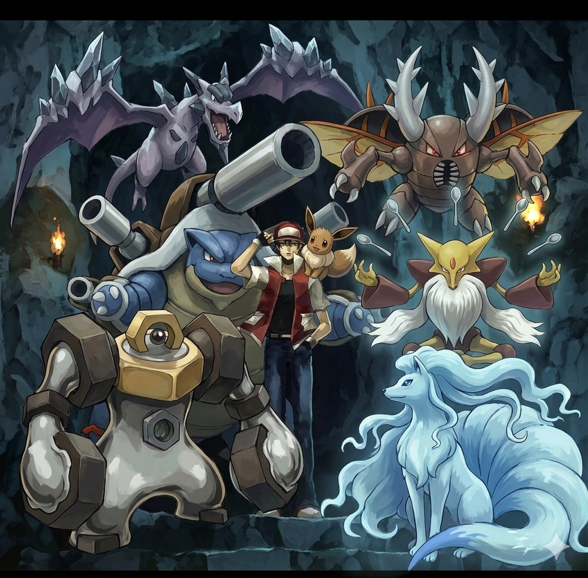
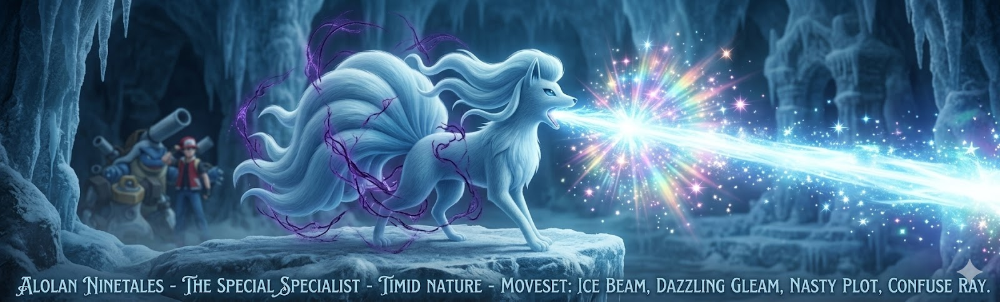
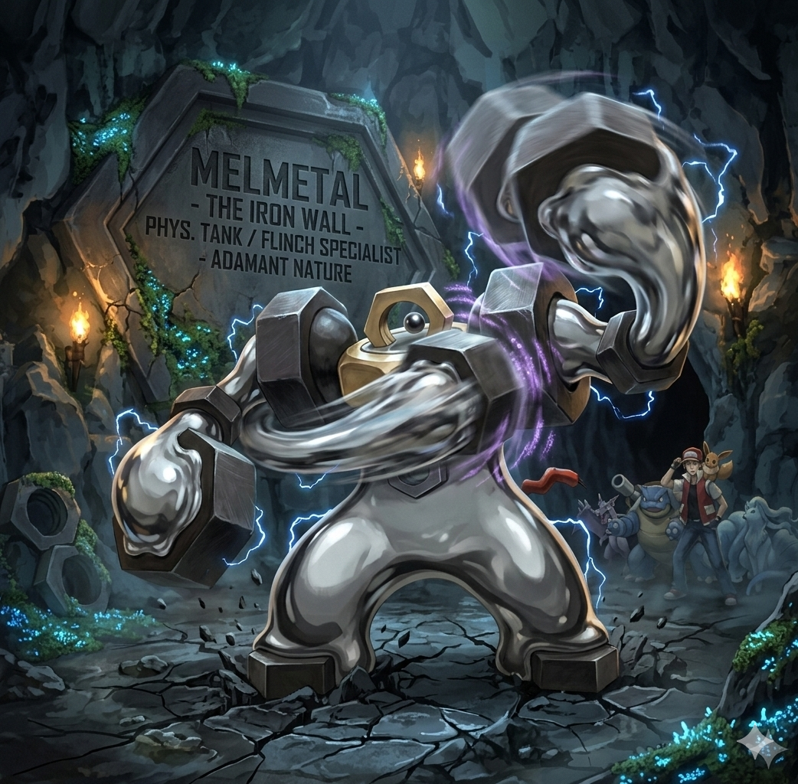
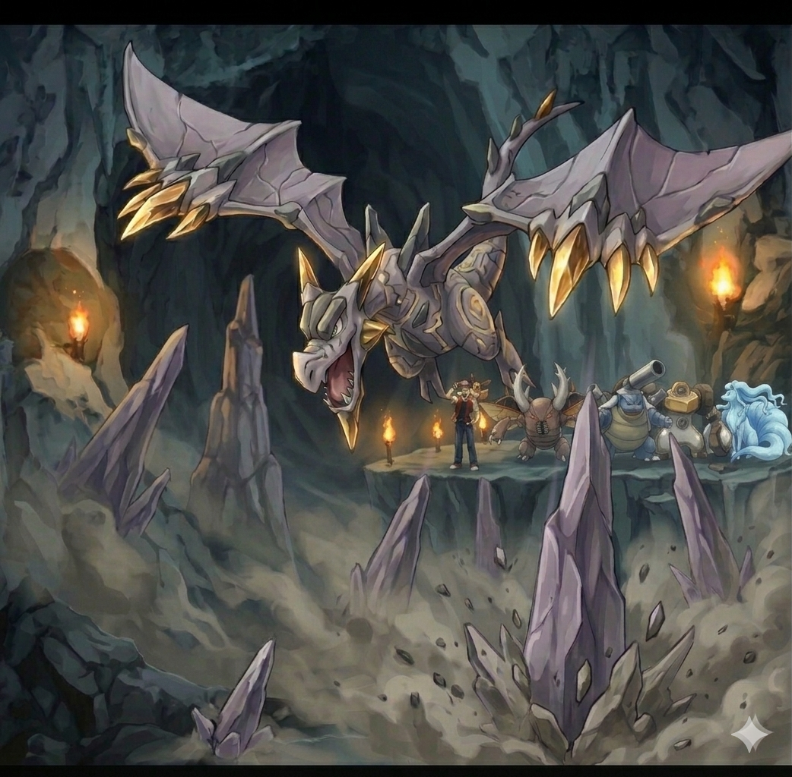
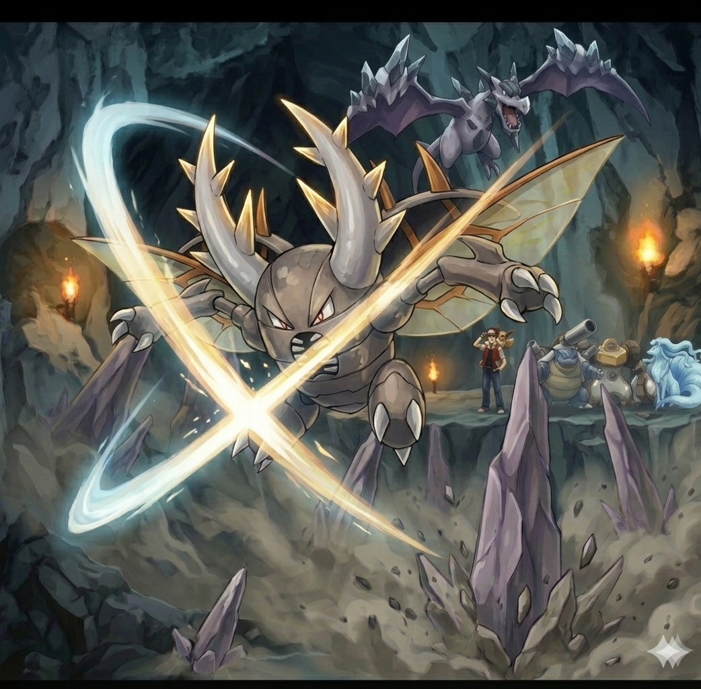
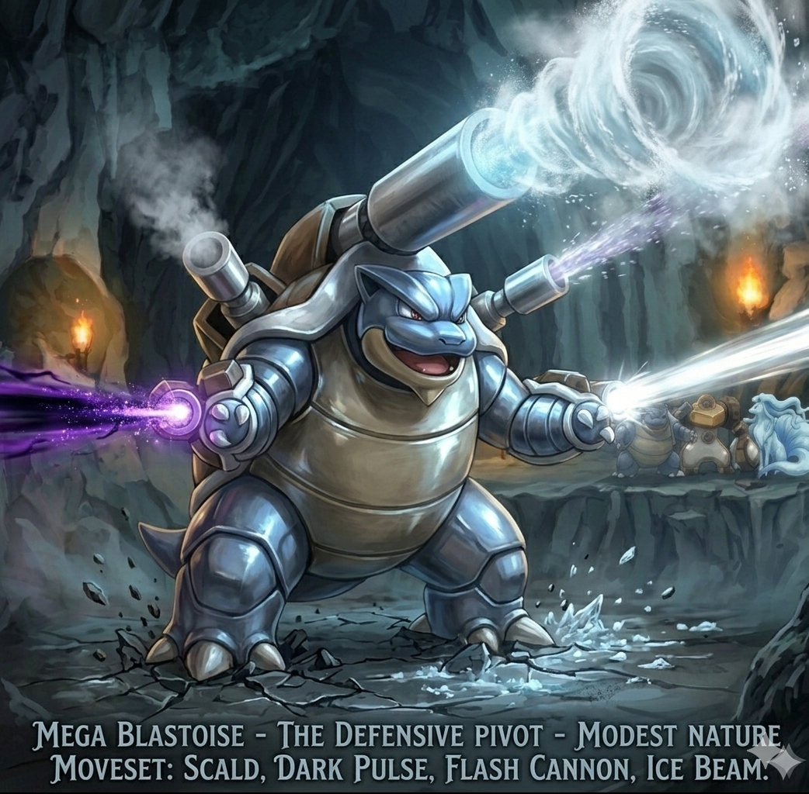
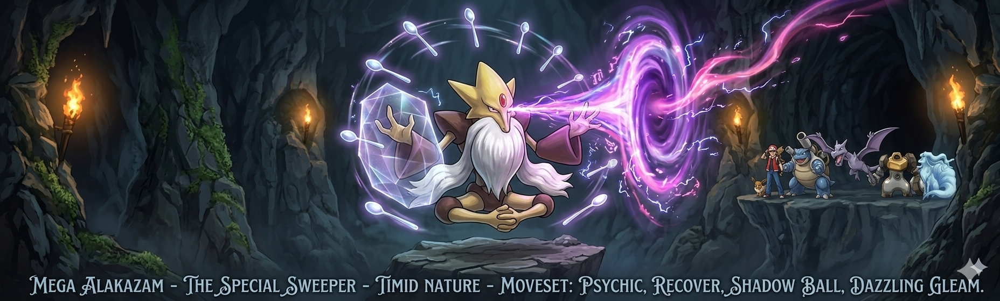
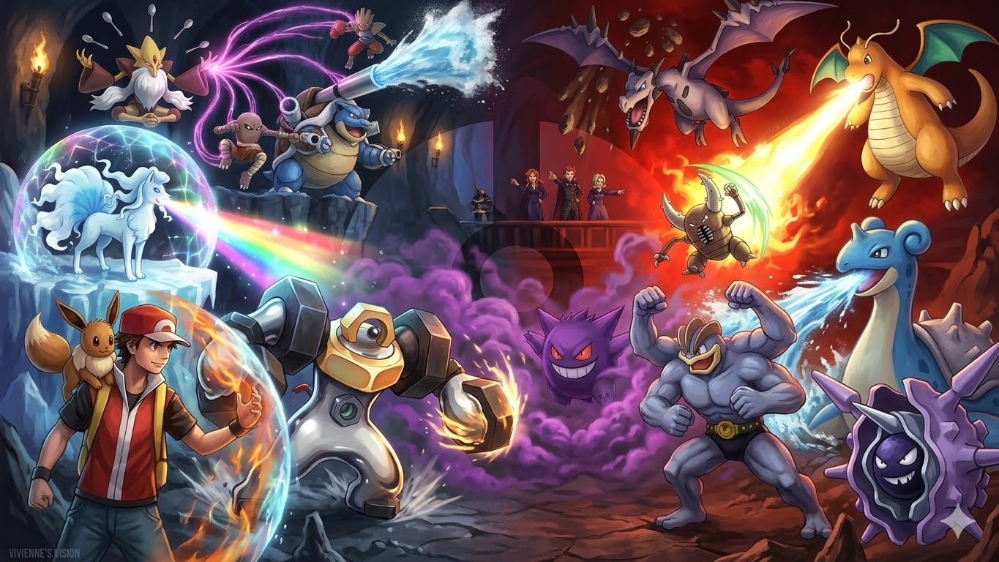
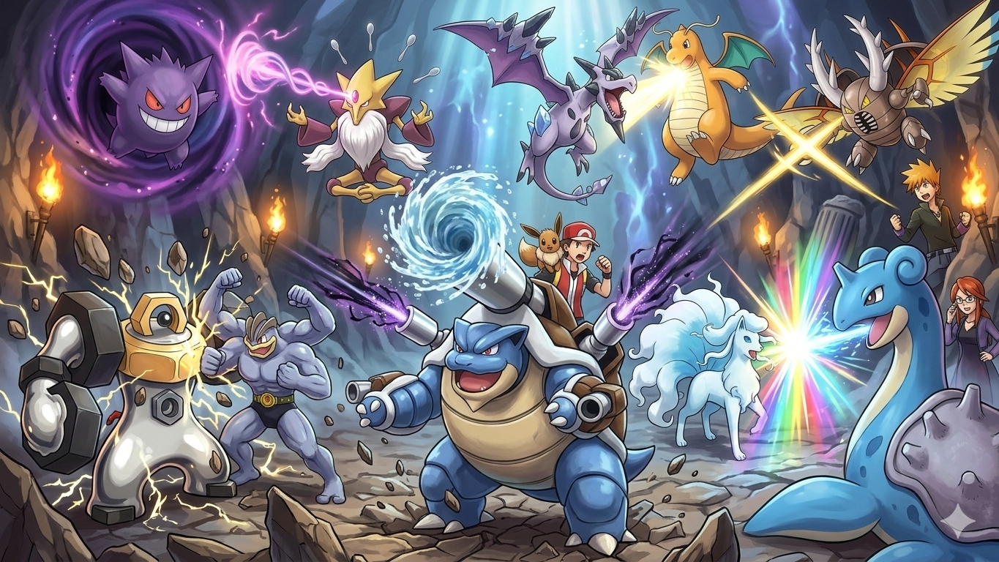

# Pokémon Let's Go Eevee Team

**Back to Main:** [https://phuchduong.github.io/MoogleSaveBook/](https://phuchduong.github.io/MoogleSaveBook/)

**Website:** [https://phuchduong.github.io/MoogleSaveBook/pokemon-lets-go/](https://phuchduong.github.io/MoogleSaveBook/pokemon-lets-go/)

---

## 🛡️ The Roster

### 1. [Alolan Ninetales](https://pokemondb.net/pokedex/ninetales/moves/7) (The Special Specialist)
* **Role:** Fast Special Attacker
* **Nature:** Timid (+Speed, -Attack)
* **Moveset:**
    * `Ice Beam` (Reliable Dragon-slaying STAB)
    * `Dazzling Gleam` (Fairy STAB)
    * `Nasty Plot` (Boosts Special Attack to sweeping levels) / `Hypnosis` / `Calm Mind`
    * `Confuse Ray` / `Dark Pulse` / `Reflect` / `Dream Eater`

### 2. [Melmetal](https://pokemondb.net/pokedex/melmetal/moves/7) (The Iron Wall)
* **Role:** Physical Tank & Flinch Specialist
* **Nature:** Adamant (+Attack, -SpAtk)
* **Moveset:**
    * `Double Iron Bash` (Hits twice; massive 51% flinch chance)
    * `Thunder Punch` (Hits Water types hard)
    * `Superpower` / `Brick Break`
    * `Earthquake` (Ground coverage) / `Thunder Wave`

### 3. [Mega Aerodactyl](https://pokemondb.net/pokedex/aerodactyl/moves/7) (The Speed King & Mega Lead)
* **Role:** Hazards & Fast Physical Attacker
* **Mega Evolution:** Primary Mega choice for the team.
* **Nature:** Jolly (+Speed, -SpAtk)
* **Moveset:**
    * `Stealth Rock` (Essential for breaking Focus Sashes)
    * `Rock Slide` (High Flinch chance + STAB)
    * `Wing Attack`
    * `Earthquake` (Coverage for Electric/Steel) / `Crunch` / `Roost`

### 4. [Mega Pinsir](https://pokemondb.net/pokedex/pinsir/moves/7) (The Backup Mega / Wallbreaker)
* **Role:** Physical Sweeper
* **Mega Evolution:** Secondary Mega choice (use if Aerodactyl isn't needed).
* **Nature:** Jolly (+Speed, -SpAtk)
* **Moveset:**
    * `Swords Dance` (Massive Attack boost) / `Bulk Up`
    * `X-Scissor` (Primary Bug STAB)
    * `Superpower` (Strong Fighting coverage) / `Brick Break`
    * `Stealth Rock` / `Focus Energy` / `Rock Slide`

### 5. [Mega Blastoise](https://pokemondb.net/pokedex/blastoise/moves/7) (The Defensive Pivot)
* **Role:** Special Attacker & Fire/Ground Wall
* **Mega Evolution:** Tertiary Mega choice; use if a bulky Water-type is needed for sustainability.
* **Nature:** Modest (+Special Attack, -Attack)
* **Moveset:**
    * `Scald` / `Surf`
    * `Bite` / `Dark Pulse`
    * `Flash Cannon`
    * `Brick Break` / `Waterfall` / `Dragon Pulse` / `Ice Beam` / `Earthquake`

### 6. [Mega Alakazam](https://pokemondb.net/pokedex/alakazam/moves/7) (The Special Sweeper)
* **Role:** Glass Cannon & Fighting-type Specialist
* **Mega Evolution:** Strong alternative Mega choice; use specifically for Bruno's team.
* **Nature:** Timid (+Speed, -Attack)
* **Moveset:**
    * `Psychic` (Massive STAB damage to one-shot Bruno's Fighting-types)
    * `Recover` (Sustainability to keep it sweeping)
    * `Tri Attack` / `Shadow Ball`
    * `Dazzling Gleam` / `Barrier` / `Calm Mind` / `Reflect` / `Thunder Wave`

---

## 🛡️ Elite Four & Champion Matchup Table

| Opponent & Pokémon | Best Counter | Super Effective Moves to Avoid | Best Offensive Move |
| :--- | :--- | :--- | :--- |
| **Lorelei, The Ice Breath (Ice/Water)** | | | |
| Dewgong | **Melmetal** / **Pinsir** | None (Resists Ice) | `Thunder Punch` |
| Jynx | **Melmetal** / **Blastoise** | None (Resists Ice/Psychic) | `Double Iron Bash` |
| Cloyster | **Melmetal** / **Pinsir** | None (Resists Ice) | `Thunder Punch` |
| Slowbro | **Blastoise** | None (Resist Water) | `Dark Pulse` |
| Lapras | **Melmetal** / **Pinsir** | None (Resists Ice) | `Thunder Punch` |
| **Bruno, The Self-Proclaimed King (Fighting/Rock)** | | | |
| Onix | **Pinsir** / **Blastoise** | None (Resists Ground) | `Superpower` |
| Hitmonlee | **Alakazam** | None | `Psychic` |
| Hitmonchan | **Alakazam** | None | `Psychic` |
| Poliwrath | **Alolan Ninetales** / **Alakazam** | None | `Dazzling Gleam` / `Psychic` |
| Machamp | **Alakazam** | None | `Psychic` |
| **Agatha, The Oldest Elite (Ghost/Poison)** | | | |
| Arbok | **Melmetal** | None (Immune to Poison) | `Earthquake` |
| Gengar (Lvl 53) | **Melmetal** | None (Immune to Poison) | `Earthquake` |
| Golbat | **Melmetal** | None (Resists Flying) | `Thunder Punch` |
| Weezing | **Melmetal** / **Alakazam** | None (Immune to Poison) | `Earthquake` |
| Gengar (Lvl 54) | **Melmetal** | None (Immune to Poison) | `Earthquake` |
| **Lance, The Dragon Master (Dragon)** | | | |
| Seadra | **Melmetal** | None (Resists Dragon) | `Thunder Punch` |
| Aerodactyl | **Blastoise** | None | `Scald` |
| Gyarados | **Melmetal** | None | `Thunder Punch` (4x) |
| Charizard | **Aerodactyl** / **Blastoise** | None | `Rock Slide` (4x) |
| Dragonite | **Aerodactyl** | None (Resists Fire Punch) | `Rock Slide` |
| **Rival Blue, The World's Greatest (Champion)** | | | |
| Mega Pidgeot | **Aerodactyl** | None (Resists Flying) | `Rock Slide` |
| Vileplume | **Aerodactyl** | None (Resists Poison) | `Wing Attack` |
| Marowak | **Blastoise** | None | `Scald` |
| Rapidash | **Aerodactyl** / **Blastoise** | None (Resists Fire/Poison) | `Rock Slide` |
| Slowbro | **Pinsir** | None | `X-Scissor` |
| Raichu | **Melmetal** | None | `Earthquake` |

---

## Other Considerations

### [Mega Venusaur](https://pokemondb.net/pokedex/venusaur) (The Giga Drain Tank)
* **Role:** Bulky Special Attacker & Grass/Poison Wall
* **Nature:** Modest (+SpAtk, -Atk) or Bold (+Def, -Atk)
* **Moveset:**
    * `Mega Drain` or `Solar Beam` (Sustainable STAB damage)
    * `Sludge Bomb` (High damage Poison STAB)
    * `Leech Seed` or `Sleep Powder` (Forced switching and health drain)
    * `Amnesia` or `Earthquake` (Boosting or hitting Fire/Steel types)

### [Mega Charizard X](https://pokemondb.net/pokedex/charizard) (The Dragon Brawler)
* **Role:** Physical Sweeper & Dragon Specialist
* **Nature:** Jolly (+Speed, -SpAtk) or Adamant (+Atk, -SpAtk)
* **Moveset:**
    * `Flare Blitz` or `Fire Punch` (Primary Fire STAB)
    * `Outrage` or `Dragon Pulse` (Powerful Dragon STAB)
    * `Thunder Punch` (Coverage for Water types)
    * `Earthquake` or `Roost` (Ground coverage or longevity)

### [Mega Charizard Y](https://pokemondb.net/pokedex/charizard) (The Scorching Sun)
* **Role:** Ultimate Special Sweeper
* **Nature:** Timid (+Speed, -Atk) or Modest (+SpAtk, -Atk)
* **Moveset:**
    * `Flamethrower` or `Fire Blast` (Incredible Special STAB)
    * `Air Slash` (Flying STAB with flinch chance)
    * `Dragon Pulse` (Neutral coverage for Dragons)
    * `Solar Beam` or `Roost` (Instant Grass coverage or healing)

### [Mega Beedrill](https://pokemondb.net/pokedex/beedrill) (The Glass Assassin)
* **Role:** High-Speed Pivot & Revenge Killer
* **Nature:** Jolly (+Speed, -SpAtk)
* **Moveset:**
    * `U-turn` (Switch out while dealing heavy damage)
    * `Poison Jab` (Main Poison STAB)
    * `X-Scissor` or `Outrage` (Bug STAB or high-power filler)
    * `Drill Run` (Crucial coverage for Steel and Rock types)

### [Mega Pidgeot](https://pokemondb.net/pokedex/pidgeot) (The Hurricane Specialist)
* **Role:** Special Sweeper
* **Nature:** Timid (+Speed, -Atk)
* **Moveset:**
    * `Air Slash` (High flinch chance Flying STAB)
    * `Heat Wave` (Fire coverage for Steel/Ice types)
    * `U-turn` or `Hyper Beam` (Pivoting or massive STAB finisher)
    * `Roost` (Recovering health on forced switches)

### [Mega Slowbro](https://pokemondb.net/pokedex/slowbro) (The Physical Fortress)
* **Role:** Physical Tank & Bulky Attacker
* **Nature:** Bold (+Def, -Atk) or Relaxed (+Def, -Speed)
* **Moveset:**
    * `Scald` (High burn chance to cripple physical attackers)
    * `Psychic` or `Psyshock` (Primary Special STAB)
    * `Calm Mind` or `Iron Defense` (Making it unkillable)
    * `Recover` (Essential sustainability)

### [Mega Gengar](https://pokemondb.net/pokedex/gengar) (The Ghostly Shadow)
* **Role:** Fast Special Sweeper & Status Spreader
* **Nature:** Timid (+Speed, -Atk)
* **Moveset:**
    * `Shadow Ball` (High damage Ghost STAB)
    * `Sludge Bomb` (High damage Poison STAB)
    * `Will-O-Wisp` (Halves opponent's physical attack)
    * `Dazzling Gleam` or `Psychic` (Coverage for Dark or Fighting types)

### [Mega Kangaskhan](https://pokemondb.net/pokedex/kangaskhan) (The Parental Attacker)
* **Role:** Physical Bruiser
* **Nature:** Jolly (+Speed, -SpAtk) or Adamant (+Atk, -SpAtk)
* **Moveset:**
    * `Fake Out` (Free flinch damage on turn one)
    * `Body Slam` or `Double-Edge` (Strong Normal STAB)
    * `Sucker Punch` (Essential priority move)
    * `Bulk Up` or `Earthquake` (Stat boosting or Ground coverage)

### [Mega Gyarados](https://pokemondb.net/pokedex/gyarados) (The Dark Leviathan)
* **Role:** Bulky Physical Sweeper
* **Nature:** Jolly (+Speed, -SpAtk) or Adamant (+Atk, -SpAtk)
* **Moveset:**
    * `Waterfall` (Water STAB with flinch chance)
    * `Crunch` (Dark STAB for Psychic/Ghost types)
    * `Earthquake` (Broad coverage for Electric/Rock)
    * `Taunt` or `Thunder Wave` (Utility to disrupt the opponent)

### [Mega Mewtwo X/Y](https://pokemondb.net/pokedex/mewtwo) (The Ultimate Legend)
* **Role:** Mixed Attacker (X) / God-Tier Special Sweeper (Y)
* **Nature:** Jolly (X) or Timid (Y)
* **Moveset:**
    * `Psychic` (Primary STAB for both forms)
    * `Brick Break` (Fighting STAB for Mega X - TM 31)
    * `Ice Beam` or `Thunderbolt` (Perfect elemental coverage)
    * `Recover` or `Calm Mind` (Longevity or further boosting)

### [Alolan Muk](https://pokemondb.net/pokedex/muk) (The Psychic Assassin)
* **Role:** Bulky Special Tank
* **Nature:** Careful (+SpDef, -SpAtk)
* **Moveset:**
    * `Crunch` (Dark STAB)
    * `Poison Jab` (Poison STAB)
    * `Fire Punch` (Steel coverage)
    * `Thunder Punch` (Water coverage)

### [Alolan Marowak](https://pokemondb.net/pokedex/marowak) (The Ghostly Defender)
* **Role:** Physical/Mixed Tank
* **Nature:** Adamant (+Atk, -SpAtk)
* **Moveset:**
    * `Flare Blitz` (Fire STAB)
    * `Shadow Ball` (Ghost STAB - Necessary as Shadow Bone is missing)
    * `Bonemerang` or `Earthquake` (Ground STAB)
    * `Will-O-Wisp` (Utility Burn) / `Swords Dance`

### [Alolan Raichu](https://pokemondb.net/pokedex/raichu) (The Surfing Sweeper)
* **Role:** Fast Special Sweeper
* **Nature:** Timid (+Speed, -Atk)
* **Moveset:**
    * `Thunderbolt` (Electric STAB)
    * `Psychic` (Psychic STAB)
    * `Surf` (Water coverage)
    * `Calm Mind` (Setup boost)

### [Alolan Sandslash](https://pokemondb.net/pokedex/sandslash) (The Ice Shaver)
* **Role:** Physical Attacker
* **Nature:** Jolly (+Speed, -SpAtk)
* **Moveset:**
    * `Icicle Crash` (Ice STAB)
    * `Iron Head` (Steel STAB)
    * `Earthquake` (Fire coverage)
    * `Swords Dance` (Attack boost)

### [Alolan Golem](https://pokemondb.net/pokedex/golem) (The Electric Artillery)
* **Role:** Physical Tank
* **Nature:** Adamant (+Atk, -SpAtk)
* **Moveset:**
    * `Thunder Punch` (Electric STAB)
    * `Rock Slide` (Rock STAB)
    * `Earthquake` (Ground coverage)
    * `Explosion` (Finisher)

### [Alolan Dugtrio](https://pokemondb.net/pokedex/dugtrio) (The Electric Ground)
* **Role:** Revenge Killer & Electric Immunity
* **Nature:** Jolly (+Speed, -SpAtk)
* **Moveset:**
    * `Earthquake` (Main STAB)
    * `Iron Head` (Steel STAB + Flinch chance)
    * `Sucker Punch` (Priority move for finishing weakened foes)
    * `Rock Slide`

### [Nidoqueen](https://pokemondb.net/pokedex/nidoqueen) (#031 - The Poison Shield)
* **Role:** Bulky Support & Hazard Setter
* **Nature:** Bold (+Def, -Atk)
* **Moveset:**
    * `Earthquake` (Primary Ground STAB)
    * `Stealth Rock` (Essential hazard for chip damage)
    * `Poison Jab` / `Sludge Bomb` / `Super Fang` (Halves opponent's HP; great for bulky targets)
    * `Toxic` / `Ice Beam` (Status or Dragon/Flying coverage) / `Thunder Bolt`

### [Nidoking](https://pokemondb.net/pokedex/nidoking) (#034 - The Versatile King)
* **Role:** Mixed Wallbreaker
* **Nature:** Jolly (+Speed, -SpAtk) or Naive (+Speed, -SpDef)
* **Moveset:**
    * `Earthquake` (High-power Ground STAB)
    * `Ice Beam` or `Ice Punch` (Best coverage for Flying and Dragon types)
    * `Poison Jab` (Main Poison STAB)
    * `Superpower` or `Megahorn` (High-power coverage)

### [Ninetales](https://pokemondb.net/pokedex/ninetales) (#038 - The Burning Sun)
* **Role:** Fast Special Attacker
* **Nature:** Timid (+Speed, -Atk)
* **Moveset:**
    * `Flamethrower` / `Fire Blast` (Primary Fire STAB)
    * `Dark Pulse` / `Solar Beam` (High-damage coverage for Water/Ground types)
    * `Nasty Plot` (Special Attack boosting) / `Confuse Ray` / `Reflect`
    * `Will-O-Wisp` (Utility to cripple physical attackers)

### [Machamp](https://pokemondb.net/pokedex/machamp) (#068 - The No-Guard Warrior)
* **Role:** Heavy Physical Attacker
* **Nature:** Adamant (+Atk, -SpAtk) or Jolly (+Speed, -SpAtk)
* **Moveset:**
    * `Superpower` (Primary Fighting STAB)
    * `Earthquake` (Ground coverage)
    * `Rock Slide` (Best Rock coverage - TM 12)
    * `Fire Punch` / `Ice Punch` / `Bulk Up` (Dragon coverage or boosting)

### [Golem](https://pokemondb.net/pokedex/golem) (#076 - The Rock Relic)
* **Role:** Physical Tank & Suicide Lead
* **Nature:** Adamant (+Atk, -SpAtk)
* **Moveset:**
    * `Earthquake` (Powerful Ground STAB)
    * `Rock Slide` (Rock STAB with flinch chance)
    * `Stealth Rock` (Hazard support)
    * `Explosion` (Massive damage finisher)

### [Magneton](https://pokemondb.net/pokedex/magneton) (#082 - The Steel Magnet)
* **Role:** Special Attacker & Defensive Pivot
* **Nature:** Timid (+Speed, -Atk)
* **Moveset:**
    * `Thunderbolt` (Main Electric STAB)
    * `Flash Cannon` (Main Steel STAB)
    * `Thunder Wave` (Utility speed control)
    * `Tri Attack` (Neutral coverage with status potential)

### [Starmie](https://pokemondb.net/pokedex/starmie) (#121 - The Elemental Pivot)
* **Role:** Special Attacker & Fire/Water Coverage
* **Nature:** Timid (+Speed, -Attack)
* **Moveset:**
    * `Surf` or `Hydro Pump` (Stops Fire types threatening Melmetal/Pinsir)
    * `Psychic` (Strong Secondary STAB)
    * `Thunderbolt` (Essential "BoltBeam" coverage)
    * `Recover` (Sustainability)

### [Lapras](https://pokemondb.net/pokedex/lapras) (#131 - The Frozen Guardian)
* **Role:** Bulky Special Tank
* **Nature:** Modest (+SpAtk, -Atk)
* **Moveset:**
    * `Surf` or `Hydro Pump` (Water STAB)
    * `Ice Beam` (Reliable Ice STAB)
    * `Thunderbolt` (Essential "BoltBeam" coverage)
    * `Confuse Ray` or `Ice Shard` (Utility or priority)

### [Vaporeon](https://pokemondb.net/pokedex/vaporeon) (#134 - The Liquid Tank)
* **Role:** Bulky Special Attacker
* **Nature:** Modest (+SpAtk, -Atk)
* **Moveset:**
    * `Scald` (Water STAB with high burn chance)
    * `Ice Beam` (Ice coverage)
    * `Acid Armor` (Boosts Physical Defense)
    * `Shadow Ball` (Coverage)

### [Jolteon](https://pokemondb.net/pokedex/jolteon) (#135 - The Lightning Bolt)
* **Role:** Fast Special Sweeper
* **Nature:** Timid (+Speed, -Atk)
* **Moveset:**
    * `Thunderbolt` (High-speed Electric STAB)
    * `Shadow Ball` (Ghost coverage)
    * `Thunder Wave` (Speed control)
    * `Yawn` or `Volt Switch` (Forcing switches or momentum)

### [Flareon](https://pokemondb.net/pokedex/flareon) (#136 - The Flaming Bruiser)
* **Role:** Physical Wallbreaker
* **Nature:** Adamant (+Atk, -SpAtk)
* **Moveset:**
    * `Flare Blitz` (High-damage Fire STAB)
    * `Superpower` (Fighting coverage)
    * `Quick Attack` (Priority)
    * `Will-O-Wisp` (Utility to help low defense)

### [Porygon](https://pokemondb.net/pokedex/porygon) (#137 - The Digital Tech)
* **Role:** Bolt-Beam Utility
* **Nature:** Modest (+SpAtk, -Atk)
* **Moveset:**
    * `Tri Attack` (Normal STAB with status chance)
    * `Ice Beam` (Coverage)
    * `Thunderbolt` (Coverage)
    * `Recover` (Longevity)

### [Omastar](https://pokemondb.net/pokedex/omastar) (#139 - The Fossil Shell)
* **Role:** Special Attacker & Physical Wall
* **Nature:** Modest (+SpAtk, -Atk)
* **Moveset:**
    * `Shell Smash` (The best setup move available to it)
    * `Hydro Pump` or `Scald` (Water STAB)
    * `Ice Beam` (Grass/Flying coverage)
    * `Earth Power` (Ground coverage)

### [Kabutops](https://pokemondb.net/pokedex/kabutops) (#141 - The Fossil Scythe)
* **Role:** Physical Sweeper
* **Nature:** Jolly (+Speed, -SpAtk)
* **Moveset:**
    * `Swords Dance` (Massive Attack boost)
    * `Waterfall` (Water STAB with flinch chance)
    * `Rock Slide` (Rock STAB with flinch chance)
    * `Aqua Jet` (Essential priority move)

### [Articuno](https://pokemondb.net/pokedex/articuno) (#144 - The Icy Legend)
* **Role:** Special Wall & Stall
* **Nature:** Timid (+Speed, -Atk)
* **Moveset:**
    * `Ice Beam` (Powerful Ice STAB)
    * `Roost` (Essential healing)
    * `Reflect` or `U-turn` (Team support or pivoting)
    * `Toxic` (Stall strategy)

### [Zapdos](https://pokemondb.net/pokedex/zapdos) (#145 - The Electric Legend)
* **Role:** Special Sweeper & Pivot
* **Nature:** Timid (+Speed, -Atk)
* **Moveset:**
    * `Thunderbolt` (Electric STAB)
    * `Drill Peck` (Flying STAB)
    * `Roost` (Longevity)
    * `U-turn` (Pivoting out of bad matchups)

### [Moltres](https://pokemondb.net/pokedex/moltres) (#146 - The Fire Legend)
* **Role:** Special Sweeper
* **Nature:** Timid (+Speed, -Atk)
* **Moveset:**
    * `Flamethrower` or `Fire Blast` (Fire STAB)
    * `Air Slash` (Flying STAB with flinch chance)
    * `Roost` (Healing)
    * `U-turn` (Pivoting)

### [Dragonite](https://pokemondb.net/pokedex/dragonite) (#149 - The Dragon Titan)
* **Role:** Mixed/Physical Sweeper
* **Nature:** Jolly (+Speed, -SpAtk) or Adamant (+Atk, -SpAtk)
* **Moveset:**
    * `Outrage` (Devastating Dragon STAB)
    * `Earthquake` (Ground coverage)
    * `Fire Punch` (Steel type coverage)
    * `Roost` or `Agility` (Healing or speed setup)
