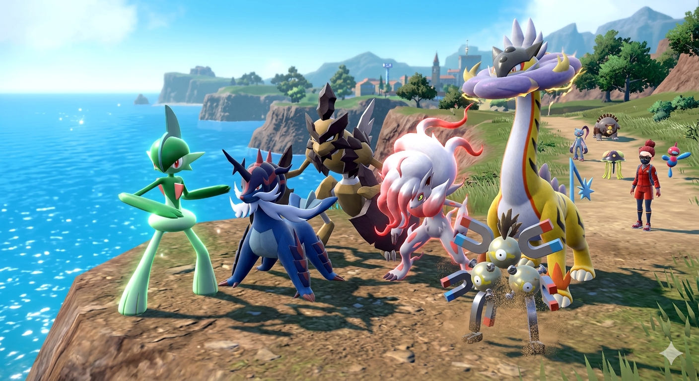
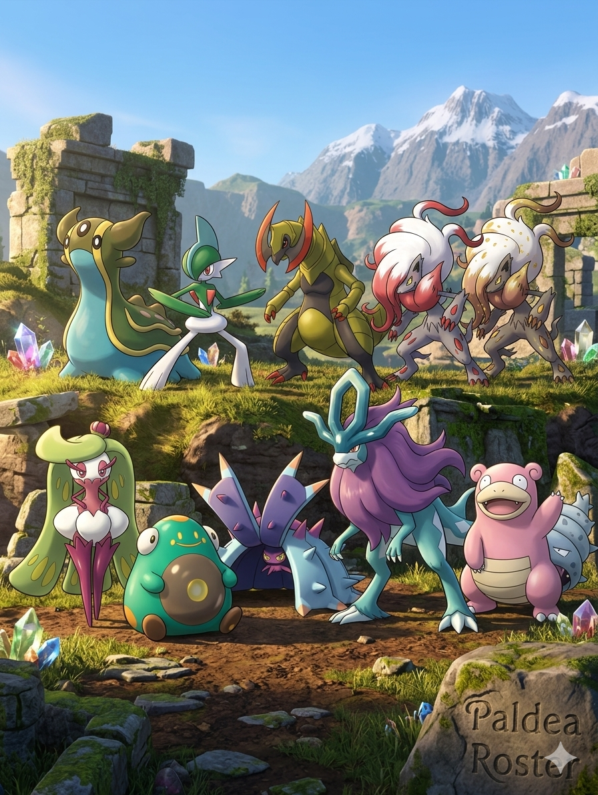
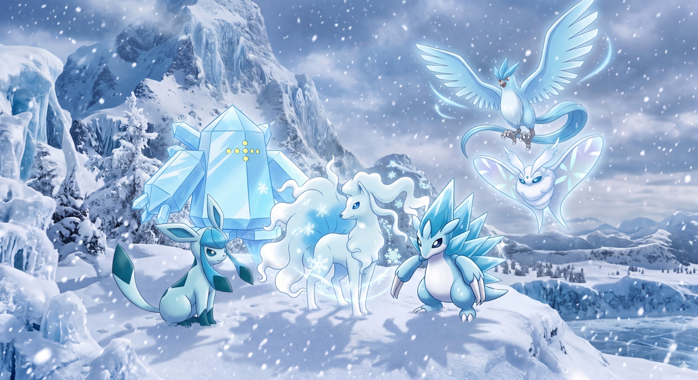
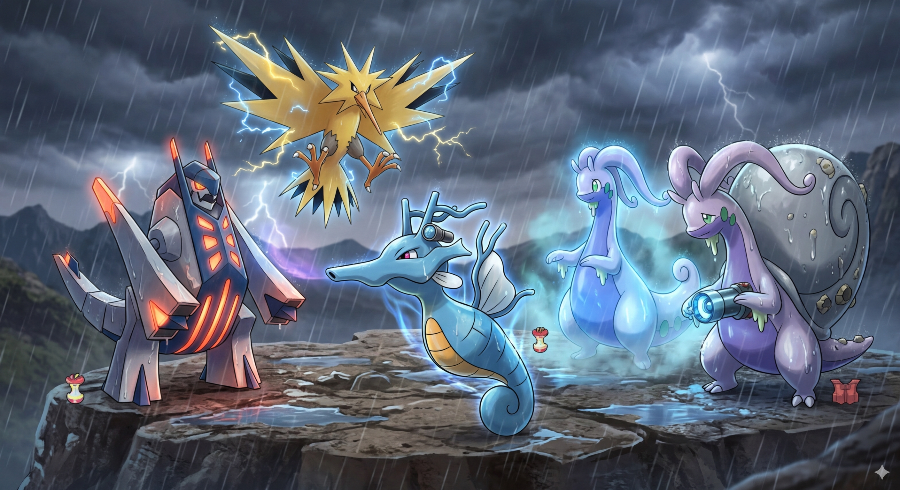
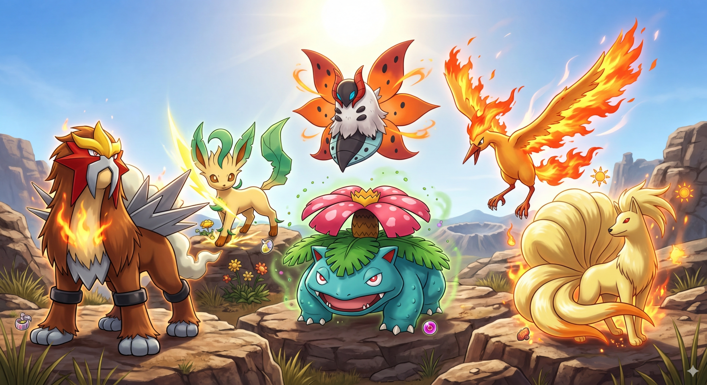
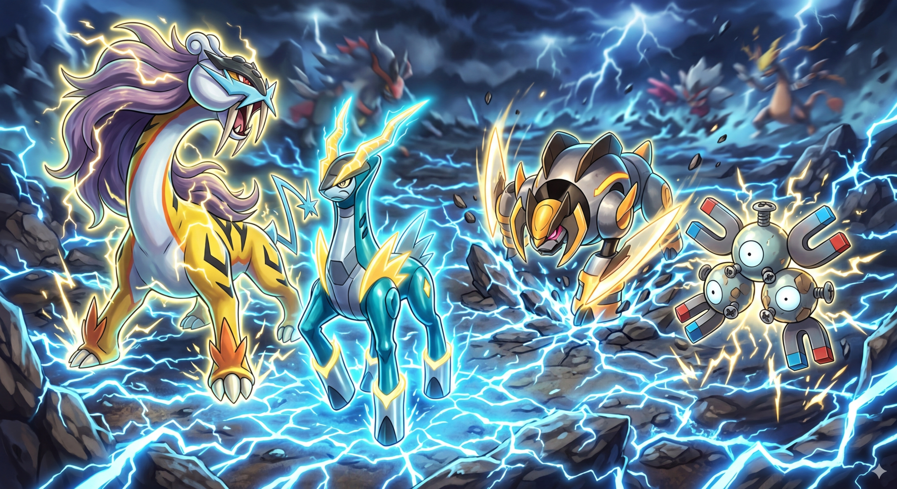
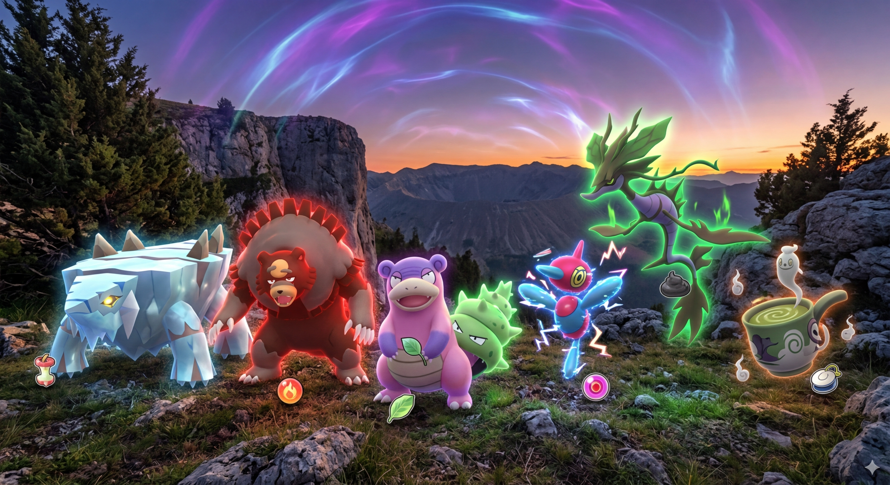
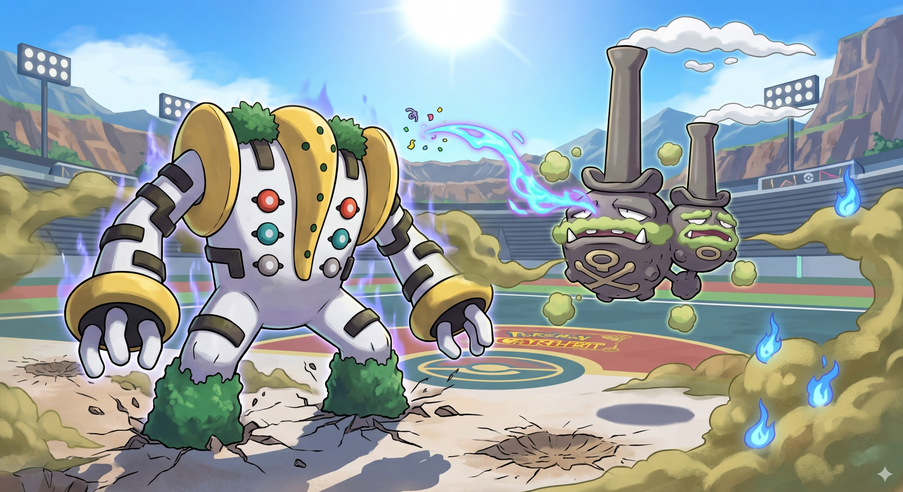
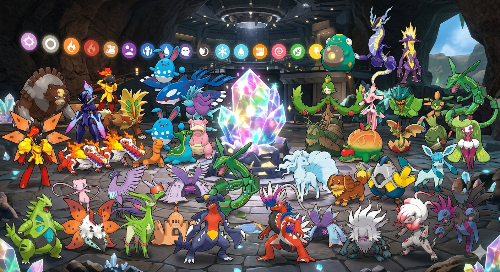

# 📱 Pokémon Scarlett Roster

**Back to Main:** [https://phuchduong.github.io/MoogleSaveBook/](https://phuchduong.github.io/MoogleSaveBook/)

**Website:** [https://phuchduong.github.io/MoogleSaveBook/pokemon-sv/](https://phuchduong.github.io/MoogleSaveBook/pokemon-sv/)

**Section Links:**

* [⚔️ Singles Roster](#%EF%B8%8F-singles-roster)
* [👯 General Doubles Roster](#%EF%B8%8F-general-doubles-roster)
* [❄️ Snow Doubles Roster](#%EF%B8%8F-snow-doubles-roster)
* [🌧️ Rain Doubles Roster](#%EF%B8%8F-rain-doubles-roster)
* [☀️ Sun Doubles Roster](#%EF%B8%8F-sun-doubles-roster)
* [⚡ Electric Terrain Doubles Roster](#-electric-terrain-doubles-roster)
* [🏃 Baton Pass Roster](#-baton-pass-roster)
* [⏳ Trick Room Roster](#-trick-room-roster)
* [☁️ Gas & Giant Doubles Roster](#%EF%B8%8F-gas--giant-doubles-roster)
* [💎 Terra Raid Roster](#-terra-raid-roster)

**Terra Raid Quicklinks:**

| Type | Type | Type | Type | Type | Type | Type | Type | Type |
| :--- | :--- | :--- | :--- | :--- | :--- | :--- | :--- | :--- |
| [Normal](#%EF%B8%8F-stab-attacker-normal-) | [Fire](#%EF%B8%8F-stab-attacker-fire-) | [Water](#%EF%B8%8F-stab-attacker-water-) | [Electric](#%EF%B8%8F-stab-attacker-electric-) | [Grass](#%EF%B8%8F-stab-attacker-grass-) | [Ice](#%EF%B8%8F%EF%B8%8F-stab-attacker-ice-%EF%B8%8F) | [Fighting](#%EF%B8%8F-stab-attacker-fighting-) | [Poison](#%EF%B8%8F%EF%B8%8F-stab-attacker-poison-%EF%B8%8F) | [Ground](#%EF%B8%8F%EF%B8%8F-stab-attacker-ground-%EF%B8%8F) |
| [Flying](#%EF%B8%8F%EF%B8%8F-stab-attacker-flying-%EF%B8%8F) | [Psychic](#%EF%B8%8F-stab-attacker-psychic-) | [Bug](#%EF%B8%8F-stab-attacker-bug-) | [Rock](#%EF%B8%8F-stab-attacker-rock-) | [Ghost](#%EF%B8%8F-stab-attacker-ghost-) | [Dragon](#%EF%B8%8F-stab-attacker-dragon-) | [Dark](#%EF%B8%8F-stab-attacker-dark-) | [Steel](#%EF%B8%8F%EF%B8%8F-stab-attacker-steel-%EF%B8%8F) | [Fairy](#%EF%B8%8F-stab-attacker-fairy-) |

---

## ⚔️ Singles Roster

<!--  -->

#### [Gallade](https://pokemondb.net/pokedex/gallade/moves/9) (The Capture Specialist)
* **Type:** 🔮 Psychic 🔮 / 🥊 Fighting 🥊
* **Tera Type:** 🌿 Grass 🌿
* **Weak To:** 🌪️ Flying, 👻 Ghost, ✨ Fairy
* **Role:** Wild Catching / Utility
* **Nature:** Jolly (+Speed, -Special Attack)
* **Ability:** Justified (Boosts Attack when hit by a Dark-type move)
* **Held Item:** None
* **Moveset:**
    * `False Swipe` (Leaves 1 HP)
    * `Hypnosis` (Inflicts Sleep)
    * `Mean Look` (Prevents Escape)
    * `Double Team` (Evasion Buff)

#### [Hisuian Samurott](https://pokemondb.net/pokedex/samurott/moves/9) (Spike Setter)
* **Type:** 💧 Water 💧 / 🌙 Dark 🌙
* **Tera Type:** 💧 Water 💧
* **Weak To:** ⚡ Electric, 🌿 Grass, 🥊 Fighting, 🐛 Bug, ✨ Fairy
* **Tera Useful Against:** 🔥 Fire, ⛰️ Ground, 💎 Rock
* **Role:** Physical Sharpness Attacker / Critical Hit Utility
* **Nature:** Adamant (+Attack, -Special Attack)
* **EVs:** 252 Atk / 4 SpD / 252 Spe (Maximizes Sharpness-boosted damage and outspeeds most NPC mid-tiers)
* **Ability:** Sharpness (Powers up slicing moves by 50%)
* **Held Item:** Scope Lens
* **Moveset:**
    * `Ceaseless Edge` (Signature Dark STAB / Spikes Support)
    * `Razor Shell` (Slicing Water STAB / Defense Drop Chance)
    * `Flip Turn` (Pivoting Water STAB)
    * `Aerial Ace` (Never-Miss Slicing Coverage)

#### [Hisuian Zoroark (Event)](https://pokemondb.net/pokedex/zoroark/moves/9) (Money Farmer)
* **Type:** ⚪ Normal ⚪ / 👻 Ghost 👻
* **Tera Type:** 🌙 Dark 🌙
* **Weak To:** 🌙 Dark
* **Role:** Money Farming / Special Support
* **Nature:** Modest (+Special Attack, -Attack)
* **EVs:** 252 SpA / 4 SpD / 252 Spe (Essential for moving first to use Happy Hour before finishing with Bitter Malice)
* **Ability:** Illusion (Enters battle disguised as the last Pokemon in the party)
* **Held Item:** Amulet Coin
* **Moveset:**
    * `Bitter Malice` (Signature Ghost Move)
    * `U-turn` (Pivoting)
    * `Happy Hour` (Doubles Prize Money)
    * `Burning Jealousy` (Fire Coverage)

#### [Kleavor](https://pokemondb.net/pokedex/kleavor/moves/9) (Stealth Rock Setter)
* **Type:** 🐛 Bug 🐛 / 💎 Rock 💎
* **Tera Type:** 🐛 Bug 🐛
* **Weak To:** 💧 Water, ⛰️ Ground, 💎 Rock, 🥊 Fighting, ⚙️ Steel
* **Tera Useful Against:** 🌿 Grass, 🔮 Psychic, 🌙 Dark
* **Role:** Physical Sharpness Attacker / Stealth Rock Setter
* **Nature:** Adamant (+Attack, -Special Attack)
* **EVs:** 252 Atk / 4 SpD / 252 Spe (Ensures Stone Axe lands first to set Rocks and deal massive Sharpness damage)
* **Ability:** Sharpness (Powers up slicing moves by 50%)
* **Held Item:** Razor Claw
* **Moveset:**
    * `Stone Axe` (Signature Rock STAB / Sets Stealth Rock)
    * `U-turn` (Pivoting Bug STAB)
    * `X-Scissor` (Slicing Bug STAB)
    * `Brick Break` (Fighting Coverage / Shield Breaker)

#### [Sneasler](https://pokemondb.net/pokedex/sneasler/moves/9) (Toxic Spike Setter)
* **Type:** 🥊 Fighting 🥊 / ☠️ Poison ☠️
* **Tera Type:** 🥊 Fighting 🥊
* **Weak To:** 🔮 Psychic (4x), 🌪️ Flying, ⛰️ Ground
* **Tera Useful Against:** ⚪ Normal, ❄️ Ice, 💎 Rock, 🌙 Dark, ⚙️ Steel
* **Role:** Physical Status Inflictor / Pivot
* **Nature:** Adamant (+Attack, -Special Attack)
* **EVs:** 252 Atk / 4 SpD / 252 Spe (Sneasler has a naturally high speed tier; this ensures you outpace nearly every NPC lead)
* **Ability:** Poison Touch (May poison a target when the Pokémon makes contact)
* **Held Item:** Leftovers
* **Moveset:**
    * `Dire Claw` (Signature Poison STAB / Chance to Poison, Paralyze, / Sleep)
    * `Toxic Spikes` (Poison Support)
    * `Brick Break` (Standard Fighting STAB / Shield Breaker)
    * `U-turn` (Pivoting Coverage)

#### [Toedscruel](https://pokemondb.net/pokedex/toedscruel/moves/9) (The Fungal Speedster)
* **Type:** ⛰️ Ground ⛰️ / 🌿 Grass 🌿
* **Tera Type:** 🌿 Grass 🌿
* **Weak To:** ❄️ Ice (4x), 🔥 Fire, 🪁 Flying, 🐜 Bug
* **Role:** Special Support / Status Inflictor
* **Nature:** Calm (+Special Defense, -Attack)
* **EVs:** 252 HP / 4 SpA / 252 SpD (Since Mycelium Might makes Spore go last anyway, invest in bulk to survive the hit before sleeping the opponent)
* **Ability:** Mycelium Might (Status moves go last, but ignore opponent abilities)
* **Held Item:** None
* **Moveset:**
    * `Spore` (Guaranteed Sleep)
    * `Giga Drain` (Special Grass STAB)
    * `Earth Power` (Special Ground STAB)
    * `Hex` (Ghost Coverage / Double damage on status) / `Sludge Bomb`

## 👯 General Doubles Roster

#### [Sinistcha](https://pokemondb.net/pokedex/sinistcha/moves/9) (The Matcha Pokémon)
* **Type:** 🌿 Grass 🌿 / 👻 Ghost 👻
* **Tera Type:** 🌿 Grass 🌿
* **Weak To:** 🔥 Fire, ❄️ Ice, 🌪️ Flying, 👻 Ghost, 🌙 Dark
* **Tera Useful Against:** 💧 Water, ⛰️ Ground, 💎 Rock
* **Role:** Special Sustain Attacker / Attack Debuffer
* **Nature:** Timid (+Speed, -Attack)
* **EVs:** 252 HP / 252 SpA / 4 Def (Prioritizes survival to benefit from Matcha Gotcha healing)
* **Ability:** Heatproof (Halves damage from Fire-type moves)
* **Held Item:** Shell Bell
* **Moveset:**
    * `Matcha Gotcha` (Signature Grass STAB / Healing & 20% Burn Chance)
    * `Shadow Ball` (Standard Ghost STAB / Special Defense Drop Chance)
    * `Nasty Plot` (Sharp Special Attack Boost) / `Reflect`
    * `Strength Sap` (Healing / Lowers Opponent's Attack) / `Trick Room`

#### [Terapagos](https://pokemondb.net/pokedex/terapagos/moves/9) (The Stellar Guardian)
* **Type:** ⚪ Normal ⚪ (Stellar when Terastalized)
* **Tera Type:** ⭐ Stellar ⭐
* **Weak To:** 🥊 Fighting
* **Tera Useful Against:** 🐲 Dragon, 🔥 Fire, 💧 Water, ⚡ Electric (Tera Shell ensures resistance at full HP)
* **Role:** Special Stellar Sweeper / Spread Attacker
* **Nature:** Modest (+Special Attack, -Attack)
* **EVs:** 252 HP / 252 SpA / 4 SpD (Maximizes offensive pressure while utilizing Tera Shell bulk)
* **Ability:** Tera Shell (At full HP, all incoming moves are not very effective) / Teraform Zero (Clears weather and terrain upon Terastalizing)
* **Held Item:** Leftovers / Choice Specs
* **Moveset:**
    * `Tera Starstorm` (Signature Move / Becomes Stellar-type spread move when Terastalized)
    * `Earth Power` (Special Ground Coverage / Special Defense Drop Chance)
    * `Calm Mind` (Special Attack and Special Defense Setup)
    * `Protect` (Essential for Doubles positioning) / `Ice Beam` (Free Spot)

#### [Serperior](https://pokemondb.net/pokedex/serperior/moves/9) (The Coil King)
* **Type:** 🌿 Grass 🌿
* **Tera Type:** 🌿 Grass 🌿
* **Weak To:** 🔥 Fire, ❄️ Ice, 🪁 Flying, 🐜 Bug, ☠️ Poison
* **Tera Useful Against:** 💧 Water, ⛰️ Ground, 💎 Rock
* **Role:** Mixed Physical Tank / Status Support
* **Nature:** Impish (+Defense, -Special Attack)
* **EVs:** 252 HP / 252 Def / 4 Atk
* **Ability:** Contrary (Reverses stat changes; causes Leaf Storm to boost Special Attack)
* **Held Item:** Leftovers
* **Moveset:**
    * `Leaf Storm` (High power Grass STAB; boosts Special Attack by 2 stages due to Contrary)
    * `Giga Drain` (Special Grass STAB; provides reliable HP restoration to maintain bulk)
    * `Dragon Pulse` (Coverage) / `Coil` (Does not work with contracy. Boosts Attack, Defense, and Accuracy)
    * `Glare` (100% accuracy Paralysis support to slow down opponents)

## ❄️ Snow Doubles Roster

#### [Alolan Ninetales](https://pokemondb.net/pokedex/ninetales/moves/9) (The Fox Pokémon)
* **Type:** ❄️ Ice ❄️ / ✨ Fairy ✨
* **Tera Type:** ❄️ Ice ❄️
* **Weak To:** ⚙️ Steel (4x), 🔥 Fire, ☠️ Poison, 💎 Rock
* **Tera Useful Against:** 🌿 Grass, ⛰️ Ground, 🌪️ Flying, 🐲 Dragon
* **Role:** Special Setup Sweeper / Snow & Screen Support
* **Nature:** Modest (+Special Attack, -Attack)
* **EVs:** 252 SpA / 4 SpD / 252 Spe (Ensures you set Aurora Veil before taking a heavy hit)
* **Ability:** Snow Warning (Summons Snow upon entering battle)
* **Held Item:** Icy Rock / Light Clay
* **Moveset:**
    * `Aurora Veil` (Halves damage from Physical and Special moves)
    * `Blizzard` (Hits Both Opponenets / High Power Ice STAB / 100% Accuracy in Snow)
    * `Dazzling Gleam` (Standard Fairy STAB)
    * `Icy Wind` (Hits Both Opponents / Speed decrease) / `Snowscape`

#### [Sandslash (Alolan)](https://pokemondb.net/pokedex/sandslash/moves/9) (Shiny)
* **Type:** ❄️ Ice ❄️ / ⚙️ Steel ⚙️
* **Tera Type:** ❄️ Ice ❄️
* **Weak To:** 🔥 Fire (4x), 🥊 Fighting (4x), ⛰️ Ground
* **Role:** Physical Setup Sweeper / Snow Support
* **Nature:** Adamant (+Attack, -Special Attack)
* **EVs:** 252 Atk / 4 Def / 252 Spe (Capitalizes on Steel typing and physical pressure)
* **Ability:** Snow Cloak (Boosts evasion in snow)
* **Held Item:** Leftovers
* **Moveset:**
    * `Icicle Crash` (Physical Ice STAB / Flinch Chance)
    * `Iron Head` (Physical Steel STAB / Flinch Chance)
    * `Snowscape` (Weather Setup)
    * `Rock Slide` (Hits Both Opponents) / `Swords Dance` (Sharp Attack Boost)

#### [Glaceon](https://pokemondb.net/pokedex/glaceon/moves/9) (The Evasive Snowsweeper)
* **Type:** ❄️ Ice ❄️
* **Tera Type:** ❄️ Ice ❄️
* **Weak To:** 🔥 Fire, 🥊 Fighting, ⛰️ Ground, ⚙️ Steel
* **Tera Useful Against:** 🌿 Grass, ⛰️ Ground, 🪁 Flying, 🐲 Dragon
* **Role:** Special Attacker / Snow Support
* **Nature:** Modest (+Special Attack, -Attack)
* **EVs:** 252 HP / 252 SpA / 4 SpD (Bulky attacker spread to utilize the Snow Defense boost)
* **Ability:** Snow Cloak (Boosts evasion in snow)
* **Held Item:** Never-Melt Ice
* **Moveset:**
    * `Blizzard` (High Power Ice STAB)
    * `Freeze-Dry` (Ice STAB / Super effective on Water)
    * `Snowscape` (Weather Setup)
    * `Icy Wind` (Special Defense Debuff)

#### [Regice](https://pokemondb.net/pokedex/regice/moves/9) (Shiny)
* **Type:** ❄️ Ice ❄️
* **Tera Type:** ⚡ Electric ⚡
* **Weak To:** 🔥 Fire, 🥊 Fighting, ⛰️ Rock, ⚙️ Steel
* **Role:** Special Tank / Stat Booster
* **Nature:** Modest (+Special Attack, -Attack)
* **EVs:** 252 HP / 252 SpA / 4 SpD (Maximizes its role as a massive special sponge)
* **Ability:** Ice Body (Heals in snow) / Clear Body (Prevents stat drops)
* **Held Item:** Leftovers / Assault Vest
* **Moveset:**
    * `Blizzard` (Hits Both Opponents / 100% Accurate in Snow)
    * `Charge Beam` (Electric Coverage / Chance to Raise Special Attack)
    * `Ancient Power` (Free Spot)
    * `Focus Blast` / `Snowscape` /  `Tera Blast` / `Thunderbolt` / `Flash Cannon` / `Icy Wind` / `Thunder Wave` / `Protect` (Free Spot)

#### [Articuno](https://pokemondb.net/pokedex/articuno/moves/9) (Shiny)
* **Type:** ❄️ Ice ❄️ / 🌪️ Flying 🌪️
* **Tera Type:** ❄️ Ice ❄️ / 💧 Water 💧
* **Weak To:** ⛰️ Rock (4x), 🔥 Fire, ⚡ Electric, ⚙️ Steel
* **Role:** Speed Support / OHKO Finisher
* **Nature:** Timid (+Speed, -Attack)
* **EVs:** 252 HP / 4 SpA / 252 Spe (Speed is vital for the Mind Reader + Sheer Cold combo)
* **Ability:** Snow Cloak (Boosts evasion in snow)
* **Held Item:** Bright Powder / Focus Sash
* **Moveset:**
    * `Blizzard` (Hits Both Opponents / 100% Accurate in Snow)
    * `Tailwind` (Doubles Team Speed for 4 turns) / `Snowscape`
    * `Mind Reader` (Next move is guaranteed to hit) / `Freeze Dry` (Water Coverage / Ice STAB)
    * `Sheer Cold` (One-Shot KO Ice Move) / `Roost`

#### [Frosmoth](https://pokemondb.net/pokedex/frosmoth/moves/9) (The Glacial Wings)
* **Type:** 🐛 Bug 🐛 / ❄️ Ice ❄️
* **Tera Type:** ❄️ Ice ❄️
* **Weak To:** 🔥 Fire (4x), 💎 Rock (4x), 🥊 Fighting, ⚙️ Steel
* **Tera Useful Against:** ⛰️ Ground, 🌪️ Flying, 🌿 Grass, 🐲 Dragon
* **Role:** Snow Sweeper / Special Tank / Setup
* **Nature:** Modest (+Special Attack, -Attack)
* **EVs:** 4 HP / 252 SpA / 252 Spe (Standard setup sweeper spread to maximize Quiver Dance)
* **Ability:** Ice Scales (Halves damage from special moves)
* **Held Item:** Light Clay / Heavy-Duty Boots
* **Moveset:**
    * `Quiver Dance` (Boosts Special Attack, Special Defense, and Speed) / `Snowscape`
    * `Blizzard` (100% accurate in Snow; massive STAB damage)
    * `Struggle Bug` (Secondary STAB + Guaranteed Special Attack Drop) / `Giga Drain`
    * `Aurora Veil` (Sets dual screens in Snow)

## 🌧️ Rain Doubles Roster

#### [Kingdra](https://pokemondb.net/pokedex/kingdra) (The Dragon Pokémon)
* **Type:** 💧 Water 💧 / 🐲 Dragon 🐲
* **Tera Type:** 🐲 Dragon 🐲
* **Weak To:** 🐲 Dragon, ✨ Fairy
* **Tera Useful Against:** 🐲 Dragon, 💧 Water, 🔥 Fire, ⚡ Electric
* **Role:** High-Burst Critical Hit Sweeper
* **Nature:** Modest (+Special Attack, -Attack)
* **EVs:** 252 SpA / 4 SpD / 252 Spe (Maximizes offensive pressure to capitalize on Sniper crits)
* **Ability:** Sniper (Powers up Critical Hits by 1.5x)
* **Held Item:** Scope Lens
* **Moveset:**
    * `Rain Dance` (Manual weather control; boosts Water moves)
    * `Draco Meteor` (Massive Dragon STAB / Sniper Crits ignore Special Attack drop)
    * `Muddy Water` (Hits Both Opponents / Rain boosted STAB / Accuracy drop chance)
    * `Hurricane` (High Power Flying coverage / 100% Accuracy in Rain)

#### [Archaludon](https://pokemondb.net/pokedex/archaludon) (The Alloy Pokémon)
* **Type:** ⚙️ Steel ⚙️ / 🐲 Dragon 🐲
* **Tera Type:** 🌪️ Flying 🌪️
* **Weak To:** 👊 Fighting, ⛰️ Ground
* **Tera Useful Against:** 🌿 Grass, 👊 Fighting, 🐜 Bug
* **Role:** Physical Tank / Critical Hit Enabler
* **Nature:** Modest (+Special Attack, -Attack)
* **EVs:** 252 HP / 252 SpA / 4 Def (Balanced bulk to stack Stamina boosts while hitting hard)
* **Ability:** Stamina (Raises Defense when hit by an attack)
* **Held Item:** Leftovers / Power Herb
* **Moveset:**
    * `Dragon Cheer` (Boosts Ally Critical Hit ratio; +2 stages for Kingdra)
    * `Electro Shot` (Raises Special Attack / Single turn use in Rain / High Power Electric coverage)
    * `Flash Cannon` (Steel STAB / High consistency)
    * `Body Press` (Fighting coverage / Damage scales with Stamina Defense boosts) / `Breaking Swipe`

#### [Zapdos](https://pokemondb.net/pokedex/zapdos) (The Electric Pokémon)
* **Type:** ⚡ Electric ⚡ / 🌪️ Flying 🌪️
* **Tera Type:** 💧 Water 💧 / ⚡ Electric ⚡
* **Weak To:** ❄️ Ice, 💎 Rock
* **Tera Useful Against:** 🔥 Fire, ⚙️ Steel, ❄️ Ice (Resists Steel/Fire as Water)
* **Role:** Speed Control / Special Rain Attacker
* **Nature:** Timid (+Speed, -Attack)
* **EVs:** 252 SpA / 4 SpD / 252 Spe (Ensures Tailwind is set quickly and maximizes Thunder/Hurricane damage)
* **Ability:** Static (Chance to paralyze on contact)
* **Held Item:** Safety Goggles / Life Orb
* **Moveset:**
    * `Thunder` (High Power Electric STAB / 100% Accuracy in Rain) / `Discharge`
    * `Tailwind` (Doubles team speed for 4 turns; vital for Sniper Kingdra) / `Rain Dance`
    * `Roost` / `Hurricane` (High Power Flying STAB / 100% Accuracy in Rain / Confusion chance)
    * `Ancient Power` / `Weather Ball` / `Volt Switch` (Water coverage in Rain / pivoting utility)

#### Goodra (The Rain Tank)
* **Type:** 🐲 Dragon 🐲
* **Tera Type:** 💧 Water 💧 (Boosts power in rain) / ⚙️ Steel ⚙️ (Defensive utility)
* **Weak To:** 🐲 Dragon, ✨ Fairy, ❄️ Ice
* **Role:** Special Tank / Rain Utility Attacker
* **Nature:** Modest (+Special Attack, -Attack) / Calm (+Special Defense, -Attack)
* **EVs:** 252 HP / 252 SpA / 4 SpD (Provides significant bulk while maintaining offensive presence)
* **Ability:** Hydration (Heals status conditions at the end of each turn in rain) / Sap Sipper (Immunity to Grass moves)
* **Held Item:** Leftovers / Assault Vest (For maximum special bulk)
* **Moveset:**
    * `Rain Dance`
    * `Muddy Water` (Receives damage boost in rain; chance to lower accuracy)
    * `Thunder` (Perfect 100% accuracy in the rain) / `Dragon Cheer` / `Sludge Wave`
    * `Breaking Swipe` / `Dragon Pulse` / `Draco Meteor` (Dragon STAB)

#### Hisuian Goodra (The Rain Shell)
* **Type:** ⚙️ Steel ⚙️ / 🐲 Dragon 🐲
* **Tera Type:** 💧 Water 💧 (Boosts Water moves) / ⚙️ Steel ⚙️ (Maximizes defensive bulk)
* **Weak To:** 👊 Fighting, ⛰️ Ground
* **Role:** Special Tank / Rain Utility Attacker
* **Nature:** Modest (+Special Attack, -Attack) / Quiet (+Special Attack, -Speed)
* **EVs:** 252 HP / 252 SpA / 4 Def (Optimizes the Steel typing's natural resistances and special power)
* **Ability:** Hydration (Heals all status conditions at the end of each turn while it is raining)
* **Held Item:** Leftovers / Assault Vest (For extreme special bulk)
* **Moveset:**
    * `Rain Dance` / `Shelter` (Signature move; raises Defense by two stages)
    * `Dragon Cheer` / `Muddy Water` / `Thunder` / `Body Press`
    * `Breaking Swipe` / `Dragon Pulse` / `Draco Meteor` (Dragon STAB)
    * `Flash Cannon` (Strong Steel STAB)

## ☀️ Sun Doubles Roster

#### [Ninetales](https://pokemondb.net/pokedex/ninetales/moves/9) (The Fox Pokémon)
* **Type:** 🔥 Fire 🔥
* **Tera Type:** 🔥 Fire 🔥 (Maximum Damage) / 🌿 Grass 🌿 (Resists Ground/Rock/Water)
* **Weak To:** 💧 Water, 💎 Rock, ⛰️ Ground
* **Tera Useful Against:** 🌿 Grass, ❄️ Ice, 🐛 Bug, ⚙️ Steel, 💧 Water, ⛰️ Ground, 💎 Rock
* **Role:** Sun Setter / Disruption Support
* **Nature:** Timid (+Speed, -Attack)
* **EVs:** 252 SpA / 4 SpD / 252 Spe (Maximizes speed to set Will-O-Wisp or Sun before being hit)
* **Ability:** Drought (Sets Sun on entry)
* **Held Item:** Heat Rock (Extends Sun to 8 turns) / Focus Sash (Survival)
* **Moveset:**
    * `Heat Wave` (Spread STAB damage)
    * `Will-O-Wisp` (Burns physical attackers)
    * `Solar Beam` (Free Spot)
    * `Extrasensory` / `Shadow Ball` / `Dark Pulse` / `Protect` / `Helping Hand` (Free Spot)

#### [Venusaur](https://pokemondb.net/pokedex/venusaur/moves/9) (The Seed Pokémon)
* **Type:** 🌿 Grass 🌿 / ☠️ Poison ☠️
* **Tera Type:** 🔥 Fire 🔥 (Boosts Weather Ball) / ⛰️ Ground ⛰️ (Coverage for Steel/Poison)
* **Weak To:** 🔥 Fire, ❄️ Ice, 🌪️ Flying, 🔮 Psychic
* **Tera Useful Against:** 🌿 Grass, ❄️ Ice, 🐛 Bug, ⚙️ Steel, ⚡ Electric, ☠️ Poison, 💎 Rock
* **Role:** Special Chlorophyll Setup Sweeper
* **Nature:** Modest (+Special Attack, -Attack)
* **EVs:** 252 SpA / 4 SpD / 252 Spe (Chlorophyll makes this extremely fast, ensuring it outspeeds almost everything in Sun)
* **Ability:** Chlorophyll (Doubles Speed in Sun)
* **Held Item:** Life Orb (Power) / Focus Sash (Guarantee Sleep Powder)
* **Moveset:**
    * `Solar Beam` (Immediate 120 BP STAB in Sun)
    * `Sludge Bomb` (Poison STAB / Fairy Coverage) / `Sunny Day`
    * `Growth` (Sharp Attack and Special Attack Boost in Sun)
    * `Sleep Powder` (Inflicts Sleep)

#### [Leafeon](https://pokemondb.net/pokedex/leafeon/moves/9) (The Verdant Pokémon)
* **Type:** 🌿 Grass 🌿
* **Tera Type:** 🔥 Fire 🔥 (Coverage and Resistance) / 💎 Rock 💎 (Hits Fire/Flying/Bug)
* **Weak To:** 🔥 Fire, ❄️ Ice, 🌪️ Flying, 🐛 Bug, ☠️ Poison
* **Tera Useful Against:** 🌿 Grass, ❄️ Ice, 🐛 Bug, ⚙️ Steel, 🔥 Fire, 🌪️ Flying
* **Role:** Physical Setup Sweeper
* **Nature:** Adamant (+Attack, -Special Attack)
* **EVs:** 252 Atk / 4 Def / 252 Spe (Maximizes physical wallbreaking power under Chlorophyll)
* **Ability:** Chlorophyll (Doubles Speed in Sun)
* **Held Item:** Clear Amulet (Prevents Intimidate) / Life Orb (Power)
* **Moveset:**
    * `Solar Blade` (Immediate 125 BP Physical STAB in Sun)
    * `Synthesis` (Heals 2/3 Max HP in Sun)
    * `Razor Leaf` (Spread STAB damage)
    * `Swords Dance` (Sharply raises Attack) / `Sunny Day`

#### [Moltres](https://pokemondb.net/pokedex/moltres/moves/9) (The Flame Pokémon)
* **Type:** 🔥 Fire 🔥 / 🌪️ Flying 🌪️
* **Tera Type:** 🔥 Fire 🔥 (Maximum Sun Damage) / ⚙️ Steel ⚙️ (Defensive Utility)
* **Weak To:** 💎 Rock (4x), ⚡ Electric, 💧 Water
* **Tera Useful Against:** 🌿 Grass, ❄️ Ice, 🐛 Bug, ⚙️ Steel, 💎 Rock, ✨ Fairy
* **Role:** Special Sun Sweeper / Tailwind Supporter
* **Nature:** Timid (+Speed, -Attack) / Modest (+Special Attack, -Attack)
* **EVs:** 252 SpA / 4 SpD / 252 Spe (Standard offensive spread to maximize Sun-boosted Heat Waves)
* **Ability:** Flame Body (30% chance to burn on contact)
* **Held Item:** Heavy-Duty Boots (Ignore Stealth Rock) / Life Orb (Pure Power)
* **Moveset:**
    * `Heat Wave` (Powerful spread STAB boosted by Sun)
    * `Hurricane` / `Air Slash` (Strong Flying STAB / Higher accuracy)
    * `Solar Beam` (Immediate 120 BP coverage in Sun)
    * `Tailwind` / `Sunny Day`

#### [Volcarona](https://pokemondb.net/pokedex/volcarona/moves/9) (The Sun Moth)
* **Type:** 🐛 Bug 🐛 / 🔥 Fire 🔥
* **Tera Type:** 🔥 Fire 🔥 (Maximum Power)
* **Weak To:** 💎 Rock (4x), 💧 Water, 🌪️ Flying
* **Tera Useful Against:** 🌿 Grass, ❄️ Ice, 🐛 Bug, ⚙️ Steel
* **Role:** Sun Sweeper / Special Attack Setup / Sustain
* **Nature:** Modest (+Special Attack, -Attack)
* **EVs:** 4 HP / 252 SpA / 252 Spe (Optimizes Quiver Dance boosts for a total sweep)
* **Ability:** Flame Body (Chance to burn on contact)
* **Held Item:** Heavy-Duty Boots (Ignore Stealth Rock)
* **Moveset:**
    * `Quiver Dance` (Boosts Special Attack, Special Defense, and Speed)
    * `Heat Wave` (Hits Both Opponents / Boosted by Sun)
    * `Struggle Bug` (Hits Both Opponents, Guaranteed Special Attack Drop)
    * `Solar Beam` (Sun team only) / `Sunny Day` / `Hurricane` (Rain Team) / `Giga Drain` / `Air Slash` / `U-turn` / `Amnesia` / `Will-O-Wisp` / `Light Screen` / `Morning Sun` / `Whirlwind` (Free Spot)

#### [Entei](https://pokemondb.net/pokedex/entei/moves/9) (The Solar Flare)
* **Type:** 🔥 Fire 🔥
* **Tera Type:** 🔥 Fire 🔥 (Maximum Power)
* **Weak To:** 💧 Water, 💎 Rock, ⛰️ Ground
* **Tera Useful Against:** 🌿 Grass, ❄️ Ice, 🐛 Bug, ⚙️ Steel
* **Role:** Physical Wallbreaker / Burn Spreader
* **Nature:** Adamant (+Attack, -Special Attack)
* **EVs:** 252 Atk / 4 SpD / 252 Spe (Maximizes the raw power of Choice Banded Sacred Fire)
* **Ability:** Inner Focus (Prevents flinching and ignores Intimidate)
* **Held Item:** Choice Band (Maximum Attack)
* **Moveset:**
    * `Sacred Fire` (Signature STAB; 50% burn chance; boosted by Sun)
    * `Extreme Speed` (High-priority finishing move)
    * `Stone Edge` (Coverage for Flying and mirror Fire types)
    * `Crunch` (Coverage for Psychic and Ghost types) / `Sunny Day` / `Solar Beam` (Sun only)

#### [Gouging Fire](https://pokemondb.net/pokedex/gouging-fire/moves/9) (The Entei Paradox)
* **Type:** 🔥 Fire 🔥 / 🐲 Dragon 🐲
* **Tera Type:** 🔥 Fire 🔥
* **Weak To:** ⛰️ Ground, 💎 Rock, 🐲 Dragon
* **Tera Useful Against:** 🌿 Grass, ❄️ Ice, 🐛 Bug, ⚙️ Steel
* **Role:** Physical Tank / Burn Support / Weather Utility
* **Nature:** Adamant (+Attack, -Special Attack)
* **EVs:** 252 HP / 156 Atk / 100 Spe (Bulky spread that triggers Protosynthesis Attack boost while outspeeding key threats)
* **Ability:** Protosynthesis (Boosts highest stat in Sun / with Booster Energy)
* **Held Item:** Leftovers
* **Moveset:**
    * `Burning Bulwark` (Signature Protection / Burns Contacting Opponents)
    * `Heat Crash` (Physical Fire STAB / Flinch & Burn Chance)
    * `Sunny Day` (Weather Control / Ability Trigger) / `Morning Sun` (Reliable Recovery Scaled by Sun)
    * `Breaking Swipe` / `Earthquake` / `Noble Roar`

## ⚡ Electric Terrain Doubles Roster

#### [Raging Bolt](https://pokemondb.net/pokedex/raging-bolt/moves/9) (The Paradox Pokémon)
* **Type:** ⚡ Electric ⚡ / 🐲 Dragon 🐲
* **Tera Type:** ⚡ Electric ⚡
* **Weak To:** ⛰️ Ground, ❄️ Ice, 🐲 Dragon, ✨ Fairy
* **Tera Useful Against:** 💧 Water, 🌪️ Flying
* **Role:** Special Electric Attacker / Weather & Status Support
* **Nature:** Modest (+Special Attack, -Attack)
* **EVs:** 252 HP / 252 SpA / 4 SpD (Maximizes natural bulk to safely fire off priority Thunderclaps)
* **Ability:** Protosynthesis (Boosts highest stat in Sun / with Booster Energy)
* **Held Item:** Shell Bell
* **Moveset:**
    * `Thunderclap` (Priority Electric STAB)
    * `Sunny Day` (Weather Control / Ability Trigger)
    * `Ancient Power` / `Thunder Wave` (Status Support)
    * `Charge Beam` (Electric STAB / Special Attack Boost Chance)

#### [Iron Crown](https://pokemondb.net/pokedex/iron-crown/moves/9) (The Paradox Pokémon)
* **Type:** ⚙️ Steel ⚙️ / 🔮 Psychic 🔮
* **Tera Type:** 💧 Water 💧 / ⚡ Electric ⚡
* **Weak To:** 🔥 Fire, 🌑 Dark, 👻 Ghost, ⛰️ Ground
* **Tera Useful Against:** 🔥 Fire, ⛰️ Ground
* **Role:** High-Speed Special Attacker / Terrain Support
* **Nature:** Timid (+Speed, -Attack)
* **EVs:** 252 SpA / 4 SpD / 252 Spe (Standard lead spread to establish Electric Terrain and outspeed threats)
* **Ability:** Quark Drive (Boosts highest stat in Electric Terrain / with Booster Energy)
* **Held Item:** Booster Energy / Terrain Extender
* **Moveset:**
    * `Electric Terrain` (Field Control / Ability Trigger / Raging Bolt Support)
    * `Tachyon Cutter` (Steel STAB / Hits Twice / Never Misses)
    * `Psyshock` / `Psychic Noise` (Psychic STAB / Prevents Target Healing)
    * `Volt Switch` / `Focus Blast` / `Air Slash` / `Protect` (Free Spot)

#### [Iron Boulder](https://pokemondb.net/pokedex/iron-boulder/moves/9) (The Paradox Pokémon)
* **Type:** ⛰️ Rock ⛰️ / 🔮 Psychic 🔮
* **Tera Type:** 👊 Fighting 👊 / 🌑 Dark 🌑
* **Weak To:** 💧 Water, 🌿 Grass, ⛰️ Ground, 🌑 Dark, 👻 Ghost, 🐛 Bug, ⚙️ Steel
* **Tera Useful Against:** 🌑 Dark, ⚙️ Steel
* **Role:** Fast Physical Attacker / Terrain Support / Shield Breaker
* **Nature:** Jolly (+Speed, -Special Attack)
* **EVs:** 252 Atk / 4 SpD / 252 Spe (Capitalizes on its elite speed tier to bypass Protection with Mighty Cleave)
* **Ability:** Quark Drive (Boosts highest stat in Electric Terrain / with Booster Energy)
* **Held Item:** Booster Energy / Focus Sash
* **Moveset:**
    * `Electric Terrain` (Field Control / Ability Trigger / Raging Bolt Support)
    * `Mighty Cleave` (Rock STAB / Hits through Protect)
    * `Psycho Cut` (Psychic STAB)
    * `Solar Blade` / `Close Combat` (Fighting Coverage / Deletes Steel types)

#### [Sandy Shocks](https://pokemondb.net/pokedex/sandy-shocks/moves/9) (The Magneton Paradox)
* **Type:** ⚡ Electric ⚡ / ⛰️ Ground ⛰️
* **Tera Type:** ⚡ Electric ⚡
* **Weak To:** 💧 Water, 🌿 Grass, ❄️ Ice, ⛰️ Ground
* **Role:** Special Speed Sweeper / Status Support
* **Nature:** Timid (+Speed, -Attack)
* **EVs:** 252 SpA / 4 SpD / 252 Spe (Provides maximum speed for pivoting and spreading paralysis)
* **Ability:** Protosynthesis (Boosts highest stat in Sun / with Booster Energy)
* **Held Item:** Booster Energy
* **Moveset:**
    * `Tri Attack` (Normal Coverage / Status Chance) / `Volt Switch`
    * `Charge Beam` (Electric STAB / Special Attack Boost Chance)
    * `Thunderbolt` / `Thunder Wave` (Status Support / Paralysis)
    * `Earth Power` (Ground STAB / Speed Control)

## ⏳ Trick Room Roster

#### [Porygon-Z](https://pokemondb.net/pokedex/porygon-z/moves/9) (The Glitched Attacker)
* **Type:** ⚪ Normal ⚪
* **Tera Type:** ⚪ Normal ⚪ / 👻 Ghost 👻
* **Weak To:** 🥊 Fighting
* **Role:** Special Wallbreaker / Nuke
* **Nature:** Timid (+Speed, -Attack) / Modest (+Special Attack, -Attack)
* **EVs:** 252 SpA / 4 SpD / 252 Spe (Maximizes offensive pressure and speed tier)
* **Ability:** Adaptability (Boosts Normal moves from 1.5x to 2x)
* **Held Item:** Life Orb / Silk Scarf / Focus Sash
* **Moveset:**
    * `Tri Attack` (Primary STAB / 20% Status Chance)
    * `Nasty Plot` (Sharp Special Attack Boost)
    * `Trick Room` / `Hyper Beam` (High Damage Finisher) / `Magnet Rise`
    * `Shadow Ball` / `Ice Beam` / `Thunderbolt` / `Tera Blast` / `Psychic` / `Dark Pulse` / `Protect` (Free Spot)

#### [Galarian Slowbro](https://pokemondb.net/pokedex/slowbro-galarian) (The Mixed Attacker)
* **Type:** ☠️ Poison ☠️ / 🔮 Psychic 🔮
* **Tera Type:** 💧 Water 💧 / 🔥 Fire 🔥
* **Weak To:** ⛰️ Ground, 🌙 Dark, 👻 Ghost
* **Role:** Trick Room Setter / Mixed Tank
* **Nature:** Quiet (+Special Attack, -Speed)
* **EVs:** 252 HP / 252 SpA / 4 Def (Optimizes bulk and power under Trick Room)
* **Ability:** Regenerator (Heals 1/3 HP on switch out)
* **Held Item:** Quick Claw / Mental Herb
* **Moveset:**
    * `Trick Room` (Essential Field Control) / `Psychic Terrain`
    * `Shell Side Arm` (Signature Poison STAB / Adaptive Damage)
    * `Psychic` / `Expanding Force` (Special Psychic STAB)
    * `Flamethrower` (Fire Coverage for Steel types) / `Nasty Plot` / `Rain Dance` / `Slack Off` / `Heal Pulse`

#### [Cresselia](https://pokemondb.net/pokedex/cresselia) (The Lunar Terrain Driver)
* **Type:** 🔮 Psychic 🔮
* **Tera Type:** 🧚 Fairy 🧚 / ⚙️ Steel ⚙️
* **Weak To:** 🪲 Bug, 🌙 Dark, 👻 Ghost
* **Role:** Trick Room Setter / Terrain Sweeper
* **Nature:** Quiet (+Special Attack, -Speed)
* **EVs:** 252 HP / 252 SpA / 4 SpD (Maximizes damage output while maintaining natural bulk)
* **Ability:** Levitate (Immune to Ground type moves)
* **Held Item:** Mental Herb / Life Orb
* **Moveset:**
    * `Psychic` / `Expanding Force` (Primary STAB; hits both opponents for massive damage in Terrain)
    * `Trick Room` (Essential Field Control for slow rosters)
    * `Psychic Terrain` (Enables Expanding Force and protects from priority)
    * `Dazzling Gleam` / `Lunar Blessing` (Team recovery and status cleanse)

#### [Ursaluna](https://pokemondb.net/pokedex/ursaluna/moves/9) (The Peat Pokémon)
* **Type:** ⛰️ Ground ⛰️ / ⚪ Normal ⚪
* **Tera Type:** ⛰️ Ground ⛰️
* **Weak To:** 🥊 Fighting, 💧 Water, 🌿 Grass, ❄️ Ice
* **Tera Useful Against:** 🔥 Fire, ⚡ Electric, ☠️ Poison, 💎 Rock, ⚙️ Steel
* **Role:** Physical Guts Sweeper / Heavy Hitter
* **Nature:** Adamant (+Attack, -Special Attack)
* **EVs:** 252 HP / 252 Atk / 4 SpD (Maximizes survivability and Guts-boosted Facade damage)
* **Ability:** Guts (Boosts Attack by 50% if the Pokémon has a status condition)
* **Held Item:** Flame Orb
* **Moveset:**
    * `Headlong Rush` (High Power Ground STAB)
    * `Body Press` (Defense-Scaled Fighting Coverage)
    * `Trailblaze` (Grass Coverage / Speed Boost Utility)
    * `Facade` (Normal STAB / Power doubles when Burned by Flame Orb)

#### [Ursaluna (Bloodmoon)](https://pokemondb.net/pokedex/ursaluna/moves/9) (The Blood Moon Beast)
* **Type:** ⛰️ Ground ⛰️ / ⚪ Normal ⚪
* **Tera Type:** ⚪ Normal ⚪
* **Weak To:** 🥊 Fighting, 💧 Water, 🌿 Grass, ⛰️ Ground
* **Tera Useful Against:** ⚪ Normal
* **Role:** Special Setup Tank / Unstoppable Special Attacker
* **Nature:** Modest (+Special Attack, -Attack)
* **EVs:** 252 HP / 252 SpA / 4 SpD (Provides necessary bulk for Calm Mind setup)
* **Ability:** Mind's Eye (Can hit Ghost-types with Normal/Fighting moves; ignores accuracy drops)
* **Held Item:** Leftovers
* **Moveset:**
    * `Blood Moon` (Signature Normal STAB / High Power)
    * `Earth Power` (Standard Ground STAB / Special Defense Drop Chance)
    * `Moonlight` (Reliable Recovery)
    * `Calm Mind` (Special Attack and Special Defense Setup)

#### [Galarian Slowking](https://pokemondb.net/pokedex/slowking-galarian) (The Chilly Pivot)
* **Type:** ☠️ Poison ☠️ / 🔮 Psychic 🔮
* **Tera Type:** ❄️ Ice ❄️ / 🌙 Dark 🌙
* **Weak To:** ⛰️ Ground, 🌙 Dark, 👻 Ghost
* **Role:** Weather Setter / Special Nuke / Pivot
* **Nature:** Quiet (+Special Attack, -Speed)
* **EVs:** 252 HP / 252 SpA / 4 SpD (Standard bulky pivot spread for maximum impact)
* **Ability:** Regenerator (Heals 1/3 HP on switch out)
* **Held Item:** Mental Herb / Assault Vest
* **Moveset:**
    * `Chilly Reception` (Sets Snow / Slow Pivot)
    * `Trick Room` (Essential Field Control)
    * `Expanding Force` (Massive Spread STAB in Terrain)
    * `Psychic Terrain` / `Sludge Wave` / `Sludge Bomb`

#### [Avalugg (Hisuian)](https://pokemondb.net/pokedex/avalugg/moves/9) (Shiny)
* **Type:** ❄️ Ice ❄️ / ⛰️ Rock ⛰️
* **Tera Type:** 🥊 Fighting 🥊
* **Weak To:** 🥊 Fighting (4x), ⚙️ Steel (4x), 🔥 Fire, 💧 Water, ⛰️ Ground, 🌿 Grass
* **Role:** Physical Tank / Defensive Wallbreaker
* **Nature:** Impish (+Defense, -Special Attack)
* **EVs:** 252 HP / 252 Def / 4 Atk (Maximizes physical walling and Body Press output)
* **Ability:** Ice Body (Heals 1/16 HP every turn in snow)
* **Held Item:** Leftovers / Rocky Helmet
* **Moveset:**
    * `Mountain Gale` (Physical Ice STAB / Flinch Chance)
    * `Aurora Veil` / `Body Press` (Uses Defense to calculate damage)
    * `Rock Slide` (Hits Both Opponents / Flinch Chance)
    * `Recover` (Reliable HP Restoration) / `Snowscape` `Iron Defense` (Sharp Defense Boost)

#### [Dragalge](https://pokemondb.net/pokedex/dragalge/moves/9) (The Poison Kelp)
* **Type:** ☠️ Poison ☠️ / 🐲 Dragon 🐲
* **Tera Type:** ☠️ Poison ☠️
* **Weak To:** ⛰️ Ground, 🔮 Psychic, ❄️ Ice, 🐲 Dragon
* **Tera Useful Against:** 🌿 Grass, ✨ Fairy
* **Role:** Special Trick Room Sweeper / Adaptability Nuke
* **Nature:** Quiet (+Special Attack, -Speed)
* **EVs:** 252 HP / 252 SpA / 4 SpD (Optimizes Adaptability boosted special attacks)
* **Ability:** Adaptability (Increases STAB multiplier from 1.5x to 2x)
* **Held Item:** Life Orb / Black Sludge
* **Moveset:**
    * `Sludge Wave` (High Power Spread Poison STAB) / `Sludge Bomb`
    * `Draco Meteor` (Massive Dragon STAB)
    * `Muddy Water` (Spread Water Coverage / Accuracy Drop Chance)
    * `Rain Dance` / `Snowscape`

#### [Solgaleo](https://pokemondb.net/pokedex/solgaleo/moves/9) (The Sun Steel)
* **Type:** ⚙️ Steel ⚙️ / 🔮 Psychic 🔮
* **Tera Type:** ⚙️ Steel ⚙️
* **Weak To:** 🔥 Fire, ⛰️ Ground, 🌙 Dark, 👻 Ghost
* **Tera Useful Against:** ❄️ Ice, 💎 Rock, ✨ Fairy
* **Role:** Physical Bruiser / Trick Room Support / Spread Move Shield
* **Nature:** Adamant (+Attack, -Special Attack)
* **EVs:** 252 HP / 252 Atk / 4 SpD (Balanced bulk and power for lead or support)
* **Ability:** Full Metal Body (Prevents stat drops)
* **Held Item:** Leftovers
* **Moveset:**
    * `Trick Room` (Field Speed Control)
    * `Sunsteel Strike` (Signature Steel STAB / Ignores Abilities)
    * `Psychic Fangs` (Psychic STAB / Breaks Screens)
    * `Noble Roar` / `Cosmic Power` / `Wide Guard` (Protects Team from Spread Moves) / `Flare Blitz` / `Wild Charge` / `Crunch` / `Close Combat` / `Stone Edge`

#### [Kommo-o](https://pokemondb.net/pokedex/kommo-o) (The Clangorous Sweeper)
* **Type:** 🐲 Dragon 🐲 / 🥊 Fighting 🥊
* **Tera Type:** ⚪ Normal ⚪ (Boosts Boomburst) / 🥊 Fighting 🥊 (Boosts Close Combat)
* **Weak To:** ✨ Fairy (4x), 🐲 Dragon, 🔮 Psychic, 🌪️ Flying, ❄️ Ice
* **Role:** Mixed Setup Sweeper
* **Nature:** Naive (+Speed, -Special Defense)
* **EVs:** 252 SpA / 4 Atk / 252 Spe (Standard fast attacker to sweep after a boost)
* **Ability:** Soundproof (Immunity to sound moves) / Bulletproof (Immunity to ball/bomb moves)
* **Held Item:** Throat Spray (Boosts Special Attack after a sound move) / Leftovers
* **Moveset:**
    * `Clangorous Soul` (Omni-Stat Boost Setup)
    * `Boomburst` (High Power Normal Spread)
    * `Close Combat` (High Power Fighting STAB)
    * `Clanging Scales` (High Power Dragon STAB)

#### [Lunala](https://pokemondb.net/pokedex/lunala) (The Moone Pokémon)
* **Type:** 🔮 Psychic 🔮 / 👻 Ghost 👻
* **Tera Type:** 👻 Ghost 👻 / ✨ Fairy ✨
* **Weak To:** 🌑 Dark (4x), 👻 Ghost (4x)
* **Role:** Special Setup Sweeper / Full HP Tank
* **Nature:** Timid (+Speed, -Attack)
* **EVs:** 252 SpA / 4 SpD / 252 Spe (Maintains high speed for sweeping versatility)
* **Ability:** Shadow Shield (Reduces damage taken by half when at full HP)
* **Held Item:** Leftovers / Life Orb
* **Moveset:**
    * `Moongeist Beam` (Signature Ghost STAB / Ignores opponent's abilities)
    * `Psyshock` (Psychic STAB / Hits physical defense) / `Psychic` / `Expanding Force`
    * `Charge Beam` / `Heat Wave` / `Moonblast` / `Calm Mind` / `Roost` / `Night Daze` / `Air Slash` / `Focus Blast` / `Light Screen` / `Reflect` / `Rain Dance` / `Sunny Day`  / `Ice Beam`
    * `Trick Room`

#### [Malamar](https://pokemondb.net/pokedex/malamar/moves/9) (The Contrary Sweeper)
* **Type:** 🔮 Psychic 🔮 / 🌙 Dark 🌙
* **Tera Type:** 💥 Fighting 💥 / 🌙 Dark 🌙
* **Weak To:** 🐛 Bug (4x), ✨ Fairy
* **Tera Useful Against:** ⚙️ Steel, 💎 Rock, ❄️ Ice
* **Role:** Physical Trick Room Sweeper / Stat Reverser
* **Nature:** Brave (+Attack, -Speed)
* **EVs:** 252 HP / 252 Atk / 4 SpD (Maximizes bulk and power while ensuring minimal speed for Trick Room)
* **Ability:** Contrary (Reverses all stat changes; e.g., Superpower raises Attack and Defense)
* **Held Item:** Leftovers / Tanga Berry
* **Moveset:**
    * `Superpower` (Fighting Coverage / Boosts Attack and Defense via Contrary)
    * `Night Slash` (Physical Dark STAB / High Critical Hit Ratio)
    * `Psycho Cut` (Physical Psychic STAB / High Critical Hit Ratio)
    * `Trick Room` (Essential Field Control) / `Topsy-Turvy` (Reverses opponent stat boosts) / `Terra Blast` (Stat boost with contrary and stella terra type)

#### [Magcargo](https://pokemondb.net/pokedex/magcargo/moves/9) (The Lava Pokémon)
* **Type:** 🔥 Fire 🔥 / 💎 Rock 💎
* **Tera Type:** 🔥 Fire 🔥
* **Weak To:** 💧 Water (4x), ⛰️ Ground (4x), 🥊 Fighting, 💎 Rock
* **Tera Useful Against:** 🌿 Grass, ❄️ Ice, 🐛 Bug, ⚙️ Steel
* **Role:** Special Trick Room Sweeper / Sun Tank
* **Nature:** Quiet (+Special Attack, -Speed)
* **EVs:** 252 HP / 252 SpA / 4 SpD (Maximizes offensive pressure and bulk for Trick Room positioning)
* **Ability:** Flame Body (30% chance to burn on contact)
* **Held Item:** Life Orb / Focus Sash
* **Moveset:**
    * `Heat Wave` / `Lava Plume` (Fire stab)
    * `Ancient Power` / `Power Gem` (Rock STAB)
    * `Earth Power` (Ground coverage for mirror Fire or Steel types)
    * `Shell Smash` (Sharp Offensive Boost) / `Recover` (Reliable Sustain)

## 🏃 Baton Pass Roster

#### [Drifblim](https://pokemondb.net/pokedex/drifblim) (The Blimp Wall)
* **Type:** 👻 Ghost 👻 / 🌪️ Flying 🌪️
* **Tera Type:** 🌿 Grass 🌿 (Resists Electric/Water/Ground) / ⚙️ Steel ⚙️ (Immune to Poison/Sandstorm)
* **Weak To:** ⚡ Electric, ❄️ Ice, 💎 Rock, 👻 Ghost, 🌙 Dark
* **Role:** Evasive Baton Pass Lead / Stall Support
* **Nature:** Calm (+Special Defense, -Attack) / Bold (+Defense, -Attack)
* **EVs:** 12 HP / 244 Def / 252 SpD (Optimizes Sitrus Berry and bulk)
* **Ability:** Unburden (Doubles Speed when the held item is consumed)
* **Held Item:** Sitrus Berry (For longevity and Unburden activation)
* **Moveset:**
    * `Baton Pass` (Pivot / Pass Stat Boosts)
    * `Strength Sap` (Healing / Attack Debuff)
    * `Minimize` (Evasion Boost)
    * `Stockpile` (Defense and Special Defense Boost)

#### [Vaporeon](https://pokemondb.net/pokedex/vaporeon) (The Bubble Jet)
* **Type:** 💧 Water 💧
* **Tera Type:** 🌿 Grass (Absorbs Spore/Grass/Electric) / 💎 Steel (Defensive Utility)
* **Weak To:** ⚡ Electric, 🌿 Grass
* **Role:** Defensive Stat Passer / HP Tank
* **Nature:** Bold (+Defense, -Attack) / Calm (+Special Defense, -Attack)
* **EVs:** 252 HP / 252 Def / 4 SpD (Maximizes physical bulk and recovery)
* **Ability:** Water Absorb (Heals when hit by Water moves)
* **Held Item:** Leftovers (Passive recovery) / Mental Herb (Avoids Taunt)
* **Moveset:**
    * `Baton Pass` (Pivot / Pass Stat Boosts and Effects)
    * `Aqua Ring` (Passive HP Recovery / Passable)
    * `Acid Armor` (Sharply Raises Defense)
    * `Substitute` / `Calm Mind` (Protection / Special Attack/Special Defense Boost)

#### [Espeon](https://pokemondb.net/pokedex/espeon) (The Sun Pokémon)
* **Type:** 🔮 Psychic 🔮
* **Tera Type:** 🔮 Psychic 🔮
* **Weak To:** 🐛 Bug, 👻 Ghost, 🌑 Dark
* **Role:** Special Setup Sweeper / Baton Pass Pivot
* **Nature:** Timid (+Speed, -Attack)
* **EVs:** 252 SpA / 4 SpD / 252 Spe (Standard sweeper spread to outpace threats)
* **Ability:** Magic Bounce (Reflects non-attacking moves)
* **Held Item:** Leftovers
* **Moveset:**
    * `Baton Pass` (Passes stat boosts to a teammate)
    * `Stored Power` (Damage increases with more stat boosts) / `Psychic` / `Expanding Force`
    * `Calm Mind` (Raises Special Attack and Special Defense) / `Psychic Terrain`
    * `Morning Sun` (Reliable HP recovery) / `Dazzling Gleam` / `Shadow Ball` / `Power Gem`

#### [Garganacl](https://pokemondb.net/pokedex/garganacl) (The Unstoppable Wall)
* **Type:** ⛰️ Rock ⛰️
* **Tera Type:** 👻 Ghost 👻 / 💧 Water 💧 / ☠️ Poison ☠️
* **Weak To:** 💧 Water, 🌿 Grass, 👊 Fighting, ⛰️ Ground, ⚙️ Steel
* **Role:** Defensive Wall / Passive Damage Dealer
* **Nature:** Careful (+Special Defense, -Special Attack)
* **EVs:** 252 HP / 4 Def / 252 SpD (Maximizes longevity to stall out Salt Cure damage)
* **Ability:** Purifying Salt (Protects from status conditions and halves Ghost type damage)
* **Held Item:** Leftovers / Rocky Helmet
* **Moveset:**
    * `Salt Cure` (Signature Move; deals 1/8 HP damage every turn, 1/4 to Steel/Water types)
    * `Recover` (Essential 50% HP recovery for sustain)
    * `Protect` / `Iron Defense` / `Sandstorm`
    * `Stone Edge` / `Body Press` (Uses Defense stat for damage) / `Stealth Rock` / `Wide Guard`

#### [Blaziken](https://pokemondb.net/pokedex/blaziken) (The Speed Passing Catalyst)
* **Type:** 🔥 Fire 🔥 / 👊 Fighting 👊
* **Tera Type:** ⚙️ Steel ⚙️ / 👻 Ghost 👻
* **Weak To:** 💧 Water, ⛰️ Ground, 🔮 Psychic, 🕊️ Flying
* **Role:** Speed Boost Sweeper / Baton Pass Pivot
* **Nature:** Jolly (+Speed, -Special Attack)
* **EVs:** 252 Atk / 4 Def / 252 Spe (Maximizes offensive pressure while ensuring Speed outscales opponents)
* **Ability:** Speed Boost (Increases Speed by 1 stage at the end of every turn)
* **Held Item:** Focus Sash / Leftovers
* **Moveset:**
    * `Baton Pass` (Passes Speed boosts and stat changes to a teammate)
    * `Protect` (Guarantees at least one free Speed boost turn)
    * `Swords Dance` (Boosts Attack to pass a lethal threat to physical partners)
    * `Flare Blitz` (High damage STAB to prevent being passive) / `Close Combat` / `Substitute`

### ☁️ Gas & Giant Doubles Roster

#### [Regigigas](https://pokemondb.net/pokedex/regigigas/moves/9) (The Unbound Giant)
* **Type:** ⚪ Normal ⚪
* **Tera Type:** 👻 Ghost 👻 (Immunity to Fighting)
* **Weak To:** 🥊 Fighting
* **Tera Useful Against:** 🥊 Fighting, 🐛 Bug, ☠️ Poison
* **Role:** Primary Physical Sweeper / Heavy Hitter
* **Nature:** Adamant (+Attack, -Special Attack)
* **EVs:** 252 Atk / 4 SpD / 252 Spe (Maximizes immediate offensive pressure)
* **Ability:** Slow Start (Suppressed by Galarian Weezing)
* **Held Item:** Clear Amulet (Prevents Intimidate)
* **Moveset:**
    * `Crush Grip` (High Power Normal STAB)
    * `Drain Punch` (Sustain and Fighting Coverage)
    * `Double-Edge` / `Knock Off` / `Stone Edge` / `High Horsepower` / `Body Slam` / `Zen Headbutt` / `Heat Crash` / `Heavy Slam` (Free Spot)

#### [Galarian Weezing](https://pokemondb.net/pokedex/weezing/moves/9) (The Gas Enabler)
* **Type:** ☠️ Poison ☠️ / ✨ Fairy ✨
* **Tera Type:** ⚙️ Steel ⚙️ (Resists Psychic/Steel/Poison)
* **Weak To:** ⛰️ Ground, 🔮 Psychic, ⚙️ Steel
* **Tera Useful Against:** 🐲 Dragon, ❄️ Ice, 💎 Rock, ✨ Fairy
* **Role:** Ability Negation / Status Support / Disruptor
* **Nature:** Bold (+Defense, -Attack)
* **EVs:** 252 HP / 252 Def / 4 SpA (Maximizes physical tankiness to keep Gas active)
* **Ability:** Neutralizing Gas (Essential for Regigigas)
* **Held Item:** Black Sludge
* **Moveset:**
    * `Strange Steam` (Fairy STAB / Confusion Chance)
    * `Sludge Bomb` (Poison STAB) / `Sludge Wave`
    * `Heat Wave` / `Will-O-Wisp` (Burns Physical Threats)
    * `Misty Terrain` / `Protect`

### ☁️ Earthquake Doubles Roster

<!--  -->

#### [Orthwurm](https://pokemondb.net/pokedex/orthwurm) (The Earthquake Sponge)
* **Type:** ⚙️ Steel ⚙️
* **Tera Type:** 🔥 Fire 🔥 / 👊 Fighting 👊 / 👻 Ghost 👻
* **Weak To:** 🔥 Fire, 👊 Fighting, ⛰️ Ground (Ability Nullified)
* **Role:** Support Pivot / Shed Tail Lead
* **Nature:** Impish (+Defense, -Special Attack)
* **EVs:** 252 HP / 252 Def / 4 SpD (Maximizes physical bulk to survive contact moves)
* **Ability:** Earth Eater (Heals 1/4 HP when hit by Ground type moves)
* **Held Item:** Sitrus Berry / Leftovers
* **Moveset:**
    * `Smack Down`
    * `Iron Defense` (Boosts survivability and Body Press damage)
    * `Body Press` (Main source of damage using high base Defense)
    * `Shed Tail` / `Helping Hand` / `Protect` / `Sandstorm`

## 💎 Terra Raid Roster

### ⚪⚔️ STAB Attacker Normal ⚪
-

### ⚪📉 STAB Debuffer Normal ⚪
-

### 🔥⚔️ STAB Attacker Fire 🔥

#### [Ceruledge](https://pokemondb.net/pokedex/ceruledge/moves/9) (The Fire Blade)
* **Type:** 🔥 Fire 🔥 / 👻 Ghost 👻
* **Tera Type:** 🔥 Fire 🔥
* **Weak To:** 💧 Water, ⛰️ Ground, 💎 Rock, 👻 Ghost, 🌙 Dark
* **Tera Useful Against:** 🌿 Grass, ❄️ Ice, 🐛 Bug, ⚙️ Steel
* **Role:** Physical Sustain Attacker / Flash Fire Utility
* **Nature:** Adamant (+Attack, -Special Attack)
* **Ability:** Flash Fire (Fire Immunity; powers up Fire moves)
* **Held Item:** Life Orb
* **Moveset:**
    * `Bitter Blade` (Healing Fire STAB)
    * `Swords Dance` (Sharp Attack Boost)
    * `Will-O-Wisp` (Burn Support)
    * `Clear Smog` (Resets Stats)

#### [Iron Moth](https://pokemondb.net/pokedex/iron-moth/moves/9) (The Volcarona Paradox)
* **Type:** 🔥 Fire 🔥 / ☠️ Poison ☠️
* **Tera Type:** 🔥 Fire 🔥
* **Weak To:** ⛰️ Ground (4x), 💧 Water, 🔮 Psychic, 💎 Rock
* **Tera Useful Against:** 🌿 Grass, ❄️ Ice, 🐛 Bug, ⚙️ Steel
* **Role:** Special Sweeper / Special Defense Debuffer
* **Nature:** Modest (+Special Attack, -Attack)
* **Ability:** Quark Drive (Boosts highest stat in Electric Terrain / with Booster Energy)
* **Held Item:** Shell Bell
* **Moveset:**
    * `Acid Spray` (Sharp Special Defense Drop)
    * `Fiery Dance` (Special Attack Boost Chance)
    * `Morning Sun` (Reliable Recovery)
    * `Electric Terrain` (Ability Trigger)

#### [Skeledirge](https://pokemondb.net/pokedex/skeledirge/moves/9) (The Singer Croc)
* **Type:** 🔥 Fire 🔥 / 👻 Ghost 👻
* **Tera Type:** 🔥 Fire 🔥
* **Weak To:** 💧 Water, ⛰️ Ground, 💎 Rock, 👻 Ghost, 🌙 Dark
* **Tera Useful Against:** 🌿 Grass, ❄️ Ice, 🐛 Bug, ⚙️ Steel
* **Role:** Special Setup Tank / Stat Ignorer
* **Nature:** Modest (+Special Attack, -Attack)
* **Ability:** Unaware (Ignores opponent stat changes)
* **Held Item:** Shell Bell
* **Moveset:**
    * `Torch Song` (Special Attack Boosting STAB)
    * `Sunny Day` (Weather Control)
    * `Will-O-Wisp` (Burn Support)
    * `Slack Off` (Reliable Recovery)

### 🔥📉 STAB Debuffer Fire 🔥

#### [Armarouge](https://pokemondb.net/pokedex/armarouge/moves/9) (The Mystical Shield)
* **Type:** 🔥 Fire 🔥 / 🔮 Psychic 🔮
* **Tera Type:** 🔥 Fire 🔥
* **Weak To:** 💧 Water, ⛰️ Ground, 💎 Rock, 👻 Ghost, 🌙 Dark
* **Tera Useful Against:** 🌿 Grass, ❄️ Ice, 🐛 Bug, ⚙️ Steel
* **Role:** STAB Fire Special Debuffer / Special Support
* **Nature:** Modest (+Special Attack, -Attack)
* **Ability:** Flash Fire (Fire immunity; first fire hit grants 50% Fire-type damage buff)
* **Held Item:** Shell Bell
* **Moveset:**
    * `Mystical Fire` (Guaranteed Special Attack Drop)
    * `Clear Smog` (Resets Stats)
    * `Reflect` (Physical Shield)
    * `Taunt` (Anti-Status)

#### [Torkoal](https://pokemondb.net/pokedex/torkoal/moves/9) (The Iron Shell)
* **Type:** 🔥 Fire 🔥
* **Tera Type:** 🔥 Fire 🔥
* **Weak To:** 💧 Water, ⛰️ Ground, 💎 Rock
* **Tera Useful Against:** 🌿 Grass, ❄️ Ice, 🐛 Bug, ⚙️ Steel
* **Role:** Physical Tank / Burn Support / Stat Reset
* **Nature:** Relaxed (+Defense, -Speed)
* **Ability:** Shell Armor (Protects from critical hits)
* **Held Item:** Leftovers
* **Moveset:**
    * `Lava Plume` (Burn Chance STAB)
    * `Iron Defense` (Sharp Defense Boost)
    * `Clear Smog` (Resets Stats)
    * `Will-O-Wisp` (Guaranteed Burn)

### 💧⚔️ STAB Attacker Water 💧

#### [Azumarill](https://pokemondb.net/pokedex/azumarill/moves/9) (The Aqua Rabbit)
* **Type:** 💧 Water 💧 / ✨ Fairy ✨
* **Tera Type:** 💧 Water 💧
* **Weak To:** ⚡ Electric, 🌿 Grass, ☠️ Poison
* **Tera Useful Against:** 🔥 Fire, ⛰️ Ground, 💎 Rock
* **Role:** Physical Setup Sweeper / Huge Power Attacker / Anti-Status
* **Nature:** Adamant (+Attack, -Special Attack)
* **Ability:** Huge Power (Doubles Attack stat)
* **Held Item:** Shell Bell
* **Moveset:**
    * `Liquidation` (Standard Water STAB)
    * `Misty Terrain` (Status Protection)
    * `Light Screen` (Special Shield)
    * `Belly Drum` (Maximizes Attack)

#### [Kyogre](https://pokemondb.net/pokedex/kyogre/moves/9) (The Sea Basin Pokémon)
* **Type:** 💧 Water 💧
* **Tera Type:** 💧 Water 💧
* **Weak To:** ⚡ Electric, 🌿 Grass
* **Tera Useful Against:** 🔥 Fire, ⛰️ Ground, 💎 Rock
* **Role:** Special Water Sweeper / Rain Setter
* **Nature:** Modest (+Special Attack, -Attack)
* **Ability:** Drizzle (Summons Rain)
* **Held Item:** Shell Bell
* **Moveset:**
    * `Water Pulse` (Confusion Chance STAB)
    * `Origin Pulse` (Signature Water STAB)
    * `Rain Dance` (Weather Control)
    * `Calm Mind` (Special Setup)

#### [Walking Wake](https://pokemondb.net/pokedex/walking-wake/moves/9) (The Suicune Paradox)
* **Type:** 💧 Water 💧 / 🐲 Dragon 🐲
* **Tera Type:** 💧 Water 💧
* **Weak To:** ⚡ Electric, 🌿 Grass
* **Tera Useful Against:** 🔥 Fire, ⛰️ Ground, 💎 Rock
* **Role:** Special Water Attacker / Sun / Rain Utility
* **Nature:** Modest (+Special Attack, -Attack)
* **Ability:** Protosynthesis (Boosts highest stat in Sun)
* **Held Item:** None
* **Moveset:**
    * `Hydro Steam` (Sun-Scalable Water STAB)
    * `Dragon Pulse` (Standard Dragon STAB)
    * `Noble Roar` (Attack and Special Attack Debuff)
    * `Flamethrower` (Fire Coverage)

### 💧📉 STAB Debuffer Water 💧

#### [Gastrodon](https://pokemondb.net/pokedex/gastrodon/moves/9) (The Storm Tank)
* **Type:** 💧 Water 💧 / ⛰️ Ground ⛰️
* **Tera Type:** 💧 Water 💧
* **Weak To:** 🌿 Grass (4x)
* **Tera Useful Against:** 🔥 Fire, ⛰️ Ground, 💎 Rock
* **Role:** Anti-Water Attacks / Physical Debuffer / Stat Reset
* **Nature:** Bold (+Defense, -Attack)
* **Ability:** Storm Drain (Draws in all Water-type moves and boosts Special Attack)
* **Held Item:** Leftovers
* **Moveset:**
    * `Chilling Water` (Lowering Physical Attack)
    * `Mud-Slap` (Lowering Accuracy)
    * `Recover` (Sustainable Healing)
    * `Clear Smog` (Clearing Stat Boosts)

#### [Slowbro](https://pokemondb.net/pokedex/slowbro/moves/9) (The Iron Bulwark)
* **Type:** 💧 Water 💧 / 🔮 Psychic 🔮
* **Tera Type:** 💧 Water 💧
* **Weak To:** 🌿 Grass, ⚡ Electric, 🐛 Bug, 👻 Ghost, 🌙 Dark
* **Tera Useful Against:** 🔥 Fire, ⛰️ Ground, 💎 Rock
* **Role:** Physical Tank / Rain Setter / Anti-Confusion
* **Nature:** Modest (+Special Attack, -Attack)
* **Ability:** Own Tempo (Prevents confusion)
* **Held Item:** Leftovers
* **Moveset:**
    * `Chilling Water` (Lowers Physical Attack)
    * `Iron Defense` (Sharp Defense Boost)
    * `Rain Dance` (Weather Control)
    * `Slack Off` (Reliable Recovery)

### ⚡⚔️ STAB Attacker Electric ⚡

#### [Bellibolt](https://pokemondb.net/pokedex/bellibolt/moves/9) (The Static Engine)
* **Type:** ⚡ Electric ⚡
* **Tera Type:** ⚡ Electric ⚡
* **Weak To:** ⛰️ Ground
* **Tera Useful Against:** 💧 Water, 🌪️ Flying
* **Role:** STAB Sustain Electric / Debuffer
* **Nature:** Modest (+Special Attack, -Attack)
* **Ability:** Electromorphosis (Boosts Electric moves when hit by an attack)
* **Held Item:** Shell Bell
* **Moveset:**
    * `Chilling Water` (Lowers Physical Attack)
    * `Parabolic Charge` (Healing Damage)
    * `Acid Spray` (Preps Special Defense Drops)
    * `Slack Off` (Reliable Recovery)

#### [Miraidon](https://pokemondb.net/pokedex/miraidon/moves/9) (The Iron Serpent)
* **Type:** ⚡ Electric ⚡ / 🐲 Dragon 🐲
* **Tera Type:** ⚡ Electric ⚡
* **Weak To:** ⛰️ Ground
* **Tera Useful Against:** 💧 Water, 🌪️ Flying
* **Role:** Special Electric Sweeper / Terrain Setter
* **Nature:** Modest (+Special Attack, -Attack)
* **Ability:** Hadron Engine (Sets Electric Terrain and boosts Special Attack)
* **Held Item:** Shell Bell
* **Moveset:**
    * `Electro Drift` (Signature Electric STAB)
    * `Parabolic Charge` (Healing Damage)
    * `Metal Sound` (Sharp Special Defense Drop)
    * `Reflect` (Physical Shield)

#### [Toxtricity](https://pokemondb.net/pokedex/toxtricity/moves/9) (The Punk Rocker)
* **Type:** ⚡ Electric ⚡ / ☠️ Poison ☠️
* **Tera Type:** ⚡ Electric ⚡
* **Weak To:** ⛰️ Ground (4x), 🔮 Psychic
* **Tera Useful Against:** 💧 Water, 🌪️ Flying
* **Role:** STAB Electric Special Attacker / Special Defense Debuffer / Paralysis
* **Nature:** Modest (+Special Attack, -Attack)
* **Ability:** Technician (Powers up weak moves)
* **Held Item:** Leftovers
* **Moveset:**
    * `Acid Spray` (Sharp Special Defense Drop)
    * `Eerie Impulse` (Sharp Special Attack Drop)
    * `Thunderbolt` (Reliable STAB)
    * `Nuzzle` (Guaranteed Paralysis)

### ⚡📉 STAB Debuffer Electric ⚡
-

### 🌿⚔️ STAB Attacker Grass 🌿

#### [Arboliva](https://pokemondb.net/pokedex/arboliva/moves/9) (The Grassy Terrain Specialist)
* **Type:** 🌿 Grass 🌿 / ⚪ Normal ⚪
* **Tera Type:** 🌿 Grass 🌿
* **Weak To:** 🔥 Fire, ❄️ Ice, 🥊 Fighting, ☠️ Poison, 🪁 Flying, 🐜 Bug
* **Tera Useful Against:** 💧 Water, ⛰️ Ground, 💎 Rock
* **Role:** Special Terrain Attacker / Sustain
* **Nature:** Modest (+Special Attack, -Attack)
* **Ability:** Seed Sower (Turns ground to Grassy Terrain when hit)
* **Held Item:** Miracle Seed
* **Moveset:**
    * `Giga Drain` (Sustain Grass STAB)
    * `Energy Ball` (High Power Grass STAB)
    * `Terrain Pulse` (Terrain Dependent STAB)
    * `Growth` (Offensive Stat Boost)

#### [Lurantis](https://pokemondb.net/pokedex/lurantis/moves/9) (The Bloom Sickle)
* **Type:** 🌿 Grass 🌿
* **Tera Type:** 🌿 Grass 🌿
* **Weak To:** 🔥 Fire, ❄️ Ice, ☠️ Poison, 🌪️ Flying, 🐛 Bug
* **Tera Useful Against:** 💧 Water, ⛰️ Ground, 💎 Rock
* **Role:** Special Contrary Sweeper / Sustain Tank
* **Nature:** Modest (+Special Attack, -Attack)
* **Ability:** Contrary (Inverts stat changes)
* **Held Item:** Shell Bell
* **Moveset:**
    * `Leaf Storm` (Self-Buffing Grass STAB)
    * `Giga Drain` (Sustain STAB)
    * `Synthesis` (Reliable Recovery)
    * `Ingrain` (Constant Recovery)

#### [Ogerpon](https://pokemondb.net/pokedex/ogerpon/moves/9) (The Mask Pokémon)
* **Type:** 🌿 Grass 🌿
* **Tera Type:** 🌿 Grass 🌿
* **Weak To:** 🔥 Fire, ❄️ Ice, 🌪️ Flying, 🐛 Bug, ☠️ Poison
* **Tera Useful Against:** 💧 Water, ⛰️ Ground, 💎 Rock
* **Role:** Physical Setup Sweeper / Critical Hit Utility
* **Nature:** Adamant (+Attack, -Special Attack)
* **Ability:** Defiant (Sharply boosts Attack if a stat is lowered)
* **Held Item:** Big Root
* **Moveset:**
    * `Ivy Cudgel` (Signature Grass STAB / High Critical Hit Ratio)
    * `Horn Leech` (Sustain Grass STAB / Healing)
    * `Throat Chop` (Dark Coverage / Sound Move Prevention)
    * `Swords Dance` (Sharp Attack Boost)

#### [Wo-Chien](https://pokemondb.net/pokedex/wo-chien/moves/9) (The Tablet Tank)
* **Type:** 🌙 Dark 🌙 / 🌿 Grass 🌿
* **Tera Type:** 🌿 Grass 🌿
* **Weak To:** 🐛 Bug (4x), 🔥 Fire, ❄️ Ice, 🥊 Fighting, ☠️ Poison, 🌪️ Flying, ✨ Fairy
* **Tera Useful Against:** 💧 Water, ⛰️ Ground, 💎 Rock
* **Role:** Passive Attack Nerfer / Sustain Tank
* **Nature:** Impish (+Defense, -Special Attack)
* **Ability:** Tablets of Ruin (Lowers Attack of all other Pokemon)
* **Held Item:** Miracle Seed
* **Moveset:**
    * `Giga Drain` (Sustain STAB)
    * `Leech Seed` (Passive Drain)
    * `Ingrain` (Constant Recovery)
    * `Snarl` (Special Attack Drop Debuff)

### 🌿📉 STAB Debuffer Grass 🌿

#### [Appletun](https://pokemondb.net/pokedex/appletun/moves/9) (The Nectar Dragon)
* **Type:** 🌿 Grass 🌿 / 🐲 Dragon 🐲
* **Tera Type:** 🌿 Grass 🌿
* **Weak To:** ❄️ Ice (4x), 🌪️ Flying, ☠️ Poison, 🐛 Bug, 🐲 Dragon, ✨ Fairy
* **Tera Useful Against:** 💧 Water, ⛰️ Ground, 💎 Rock
* **Role:** Special Defense Debuffer / Defensive Wall
* **Nature:** Modest (+Special Attack, -Attack)
* **Ability:** Ripen (Doubles the effect of Berries)
* **Held Item:** Leftovers
* **Moveset:**
    * `Apple Acid` (Guaranteed Special Defense Drop)
    * `Light Screen` (Special Shield)
    * `Iron Defense` (Sharp Defense Boost)
    * `Recover` (Reliable Recovery)

#### [Flapple](https://pokemondb.net/pokedex/flapple/moves/9) (The Tart Tank)
* **Type:** 🌿 Grass 🌿 / 🐲 Dragon 🐲
* **Tera Type:** 🌿 Grass 🌿
* **Weak To:** ❄️ Ice (4x), 🌪️ Flying, ☠️ Poison, 🐛 Bug, 🐲 Dragon, ✨ Fairy
* **Tera Useful Against:** 💧 Water, ⛰️ Ground, 💎 Rock
* **Role:** Physical Defense Debuffer / Sustainability
* **Nature:** Impish (+Defense, -Special Attack)
* **Ability:** Ripen (Doubles Berry effects)
* **Held Item:** Leftovers
* **Moveset:**
    * `Grav Apple` (Guaranteed Defense Drop)
    * `Leech Seed` (Passive Healing)
    * `Acid Spray` (Special Defense Drop)
    * `Iron Defense` (Sharp Defense Boost)

####  [Tsareena](https://pokemondb.net/pokedex/tsareena/moves/9) (The Trop Queen)
* **Type:** 🌿 Grass 🌿
* **Tera Type:** 🌿 Grass 🌿
* **Weak To:** 🔥 Fire, ❄️ Ice, ☠️ Poison, 🌪️ Flying, 🐛 Bug
* **Tera Useful Against:** 💧 Water, ⛰️ Ground, 💎 Rock
* **Role:** STAB Grass Attack Debuffer / Sleep Guard
* **Nature:** Adamant (+Attack, -Special Attack)
* **Ability:** Sweet Veil (Prevents self and allies from falling asleep)
* **Held Item:** Shell Bell
* **Moveset:**
    * `Trop Kick` (Guaranteed Attack Drop)
    * `Reflect` (Physical Shield)
    * `Taunt` (Utility)
    * `Synthesis` (Nature-based Healing)

### ❄️⚔️ STAB Attacker Ice ❄️

#### [Alolan Ninetales](https://pokemondb.net/pokedex/ninetales/moves/9) (The Fox Pokémon)
* **Type:** ❄️ Ice ❄️ / ✨ Fairy ✨
* **Tera Type:** ❄️ Ice ❄️
* **Weak To:** ⚙️ Steel (4x), 🔥 Fire, ☠️ Poison, 💎 Rock
* **Tera Useful Against:** 🌿 Grass, ⛰️ Ground, 🌪️ Flying, 🐲 Dragon
* **Role:** Special Setup Sweeper / Snow & Screen Support
* **Nature:** Modest (+Special Attack, -Attack)
* **Ability:** Snow Warning (Summons Snow upon entering battle)
* **Held Item:** Light Clay
* **Moveset:**
    * `Dazzling Gleam` (Standard Fairy STAB)
    * `Blizzard` (High Power Ice STAB / 100% Accuracy in Snow)
    * `Aurora Veil` (Halves damage from Physical and Special moves)
    * `Nasty Plot` (Sharp Special Attack Boost)

#### [Glaceon](https://pokemondb.net/pokedex/glaceon/moves/9) (The Frozen Mirror)
* **Type:** ❄️ Ice ❄️
* **Tera Type:** ❄️ Ice ❄️
* **Weak To:** 🔥 Fire, 🥊 Fighting, ⛰️ Ground, ⚙️ Steel
* **Tera Useful Against:** 🌿 Grass, ⛰️ Ground, 🪁 Flying, 🐲 Dragon
* **Role:** Special Attacker / Snow Support
* **Nature:** Modest (+Special Attack, -Attack)
* **Ability:** Snow Cloak (Boosts evasion in snow)
* **Held Item:** Never-Melt Ice
* **Moveset:**
    * `Freeze-Dry` (Ice STAB / Super effective on Water)
    * `Ice Beam` (High Power Ice STAB)
    * `Snowscape` (Weather Setup)
    * `Fake Tears` (Special Defense Debuff)

### ❄️📉 STAB Debuffer Ice ❄️
-

### 🥊⚔️ STAB Attacker Fighting 🥊

#### [Annihilape](https://pokemondb.net/pokedex/annihilape/moves/9) (The Raging Monkey)
* **Type:** 🥊 Fighting 🥊 / 👻 Ghost 👻
* **Tera Type:** 🥊 Fighting 🥊
* **Weak To:** 🌪️ Flying, 🔮 Psychic, 👻 Ghost, ✨ Fairy
* **Tera Useful Against:** ⚪ Normal, ❄️ Ice, 💎 Rock, 🌙 Dark, ⚙️ Steel
* **Role:** Physical Attacker / Flinch Protection
* **Nature:** Adamant (+Attack, -Special Attack)
* **Ability:** Inner Focus (Prevents flinching)
* **Held Item:** Metronome
* **Moveset:**
    * `Drain Punch` (Sustain STAB)
    * `Sunny Day` (Weather Control)
    * `Brick Break` (Shield/Screen Breaker)
    * `Focus Energy` (Crit Ratio Boost)

#### [Dachsbun](https://pokemondb.net/pokedex/dachsbun/moves/9) (The Fireproof Hound)
* **Type:** ✨ Fairy ✨
* **Tera Type:** 🥊 Fighting 🥊
* **Weak To:** ☠️ Poison, ⚙️ Steel
* **Tera Useful Against:** ⚪ Normal, ❄️ Ice, 💎 Rock, 🌙 Dark, ⚙️ Steel
* **Role:** Anti-Fire Attacker / Fire Immunity Support
* **Nature:** Impish (+Defense, -Special Attack)
* **Ability:** Well-Baked Body (Fire immunity; fire hits grant 2x Defense boost)
* **Held Item:** Terrain Extender
* **Moveset:**
    * `Body Press` (Defense-Scaled Damage)
    * `Mud-Slap` (Accuracy Drop)
    * `Misty Terrain` (Status Protection)
    * `Rain Dance` (Weather Control)

#### [Iron Hands](https://pokemondb.net/pokedex/iron-hands/moves/9) (The Hariyama Paradox)
* **Type:** 🥊 Fighting 🥊 / ⚡ Electric ⚡
* **Tera Type:** 🥊 Fighting 🥊
* **Weak To:** ⛰️ Ground, 🔮 Psychic, ✨ Fairy
* **Tera Useful Against:** ⚪ Normal, ❄️ Ice, 💎 Rock, 🌙 Dark, ⚙️ Steel
* **Role:** Physical Setup Sweeper / Drain Attacker
* **Nature:** Adamant (+Attack, -Special Attack)
* **Ability:** Quark Drive (Boosts highest stat in Electric Terrain / with Booster Energy)
* **Held Item:** Shell Bell
* **Moveset:**
    * `Drain Punch` (Sustain STAB)
    * `Force Palm` (Paralysis Chance STAB)
    * `Brick Break` (Shield/Screen Breaker)
    * `Belly Drum` (Maximizes Attack)

#### [Koraidon](https://pokemondb.net/pokedex/koraidon/moves/9) (The Winged King)
* **Type:** 🥊 Fighting 🥊 / 🐲 Dragon 🐲
* **Tera Type:** 🥊 Fighting 🥊
* **Weak To:** ✨ Fairy (4x), 🌪️ Flying, 🔮 Psychic, 🐲 Dragon, ❄️ Ice
* **Tera Useful Against:** ⚪ Normal, ❄️ Ice, 💎 Rock, 🌙 Dark, ⚙️ Steel
* **Role:** Physical Fighting Sweeper / Sun Setter
* **Nature:** Adamant (+Attack, -Special Attack)
* **Ability:** Orichalcum Pulse (Sets Sun and boosts Attack)
* **Held Item:** Shell Bell
* **Moveset:**
    * `Collision Course` (Signature Fighting STAB)
    * `Drain Punch` (Sustain STAB)
    * `Swords Dance` (Sharp Attack Boost)
    * `Breaking Swipe` (Attack Drop Debuff)

### 🥊📉 STAB Debuffer Fighting 🥊

#### [Galarian Zapdos](https://pokemondb.net/pokedex/zapdos/moves/9) (The Thunderous Kicker)
* **Type:** 🥊 Fighting 🥊 / 🌪️ Flying 🌪️
* **Tera Type:** 🥊 Fighting 🥊
* **Weak To:** 🌪️ Flying, ⚡ Electric, 🔮 Psychic, ❄️ Ice, ✨ Fairy
* **Tera Useful Against:** ⚪ Normal, ❄️ Ice, 💎 Rock, 🌙 Dark, ⚙️ Steel
* **Role:** STAB Fighting Physical Attacker / Defense Debuffer
* **Nature:** Adamant (+Attack, -Special Attack)
* **Ability:** Defiant (Boosts Attack when stats are lowered)
* **Held Item:** Shell Bell
* **Moveset:**
    * `Thunderous Kick` (Guaranteed Defense Drop)
    * `Bulk Up` (Attack and Defense Setup)
    * `Taunt` (Anti-Status)
    * `Tailwind` (Speed Support)

### ☠️⚔️ STAB Attacker Poison ☠️

-

### ☠️📉 STAB Debuffer Poison ☠️

#### [Toxapex](https://pokemondb.net/pokedex/toxapex/moves/9) (The Unkillable Bunker)
* **Type:** ☠️ Poison ☠️ / 💧 Water 💧
* **Tera Type:** ☠️ Poison ☠️
* **Weak To:** ⚡ Electric, ⛰️ Ground, 🔮 Psychic
* **Tera Useful Against:** 🌿 Grass, ✨ Fairy
* **Role:** STAB Attacker Poison / Defensive Wall / Special Defense Debuffer
* **Nature:** Bold (+Defense, -Attack)
* **Ability:** Limber (Prevents paralysis)
* **Held Item:** Leftovers
* **Moveset:**
    * `Acid Spray` (Sharp Special Defense Drop)
    * `Sludge Bomb` (Poison Chance STAB)
    * `Chilling Water` (Spamable Attack Drop)
    * `Recover` (Standard Recovery)

### ⛰️⚔️ STAB Attacker Ground ⛰️

#### [Garchomp](https://pokemondb.net/pokedex/garchomp/moves/9) (The Mach Dragon)
* **Type:** 🐲 Dragon 🐲 / ⛰️ Ground ⛰️
* **Tera Type:** ⛰️ Ground ⛰️
* **Weak To:** ❄️ Ice (4x), 🐲 Dragon, ✨ Fairy
* **Tera Useful Against:** 🔥 Fire, ⚡ Electric, ☠️ Poison, 💎 Rock, ⚙️ Steel
* **Role:** Physical Setup Attacker / Evasion Tank
* **Nature:** Adamant (+Attack, -Special Attack)
* **Ability:** Sand Veil (Increases Evasion in Sandstorm)
* **Held Item:** Shell Bell
* **Moveset:**
    * `Earthquake` (Standard Ground STAB)
    * `Swords Dance` (Sharp Attack Boost)
    * `Sleep Talk` (Anti-Sleep Utility)
    * `Rest` (Full Recovery)

#### [Groudon](https://pokemondb.net/pokedex/groudon/moves/9) (The Continent Pokémon)
* **Type:** ⛰️ Ground ⛰️
* **Tera Type:** ⛰️ Ground ⛰️
* **Weak To:** 💧 Water, 🌿 Grass, ❄️ Ice
* **Tera Useful Against:** 🔥 Fire, ⚡ Electric, ☠️ Poison, 💎 Rock, ⚙️ Steel
* **Role:** Physical Ground Sweeper / Sun Setter
* **Nature:** Adamant (+Attack, -Special Attack)
* **Ability:** Drought (Summons harsh sunlight)
* **Held Item:** Shell Bell
* **Moveset:**
    * `Precipice Blades` (Signature Ground STAB)
    * `Body Press` (Defense-Scaled Damage)
    * `Heavy Slam` (Weight-Based Coverage)
    * `Swords Dance` (Sharp Attack Boost)

#### [Palossand](https://pokemondb.net/pokedex/palossand/moves/9) (The Sand Castle)
* **Type:** 👻 Ghost 👻 / ⛰️ Ground ⛰️
* **Tera Type:** ⛰️ Ground ⛰️
* **Weak To:** 💧 Water, 🌿 Grass, ❄️ Ice, 👻 Ghost, 🌙 Dark
* **Tera Useful Against:** 🔥 Fire, ⚡ Electric, ☠️ Poison, 💎 Rock, ⚙️ Steel
* **Role:** Special Ground Attacker / Physical Tank
* **Nature:** Modest (+Special Attack, -Attack)
* **Ability:** Water Compaction (Sharp Defense boost when hit by Water)
* **Held Item:** Leftovers
* **Moveset:**
    * `Earth Power` (Standard Ground STAB)
    * `Sandstorm` (Weather Control)
    * `Amnesia` (Sharp Special Defense Boost)
    * `Shore Up` (Reliable Recovery)

### ⛰️📉 STAB Debuffer Ground ⛰️
-

### 🌪️⚔️ STAB Attacker Flying 🌪️

#### [Rayquaza](https://pokemondb.net/pokedex/rayquaza/moves/9) (The Sky High Striker)
* **Type:** 🐲 Dragon 🐲 / 🌪️ Flying 🌪️
* **Tera Type:** 🌪️ Flying 🌪️
* **Weak To:** ❄️ Ice (4x), 💎 Rock, 🐲 Dragon, ✨ Fairy
* **Tera Useful Against:** 🌿 Grass, 🥊 Fighting, 🐛 Bug
* **Role:** Physical Sweeper / Weather Nullifier
* **Nature:** Adamant (+Attack, -Special Attack)
* **Ability:** Air Lock (Eliminates the effects of weather)
* **Held Item:** Shell Bell
* **Moveset:**
    * `Dragon Ascent` (High Power Flying STAB)
    * `Swords Dance` (Sharp Attack Boost)
    * `Ancient Power` (Stat Boost Chance)
    * `Air Slash` (Flinch Chance STAB)

#### [Walking Wake](https://pokemondb.net/pokedex/walking-wake/moves/9) (Hurricane Rain Dancer)
* **Type:** 💧 Water 💧 / 🐲 Dragon 🐲
* **Tera Type:** 🌪️ Flying 🌪️
* **Weak To:** 🐲 Dragon, ✨ Fairy
* **Tera Useful Against:** 🌿 Grass, 🥊 Fighting, 🐛 Bug
* **Role:** Special Attacker / Rain Support
* **Nature:** Modest (+Special Attack, -Attack)
* **Ability:** Protosynthesis (Boosts highest stat in Sun / with Booster Energy)
* **Held Item:** Shell Bell
* **Moveset:**
    * `Rain Dance` (Self-Buffing Weather)
    * `Hurricane` (High Power Flying STAB)
    * `Chilling Water` (Attack Debuffer)
    * `Hydro Steam` (Sun/Rain Scalable STAB)

### 🌪️📉 STAB Debuffer Flying 🌪️
-

### 🔮⚔️ STAB Attacker Psychic 🔮

#### [Articuno (Galarian)](https://pokemondb.net/pokedex/articuno/moves/9) (The Cruel Pokémon)
* **Type:** 🔮 Psychic 🔮 / 🌪️ Flying 🌪️
* **Tera Type:** 🔮 Psychic 🔮
* **Weak To:** 🐛 Bug, 👻 Ghost, 🌙 Dark
* **Tera Useful Against:** 🥊 Fighting, ☠️ Poison
* **Role:** Special Psychic Attacker / Stat Drop Punisher
* **Nature:** Modest (+Special Attack, -Attack)
* **Ability:** Competitive (Sharply boosts Special Attack when stats are lowered)
* **Held Item:** Shell Bell
* **Moveset:**
    * `Freezing Glare` (Signature Psychic STAB)
    * `Hurricane` (Standard Flying STAB)
    * `Reflect` (Physical Shield)
    * `Recover` (Reliable Recovery)

#### [Iron Leaves](https://pokemondb.net/pokedex/iron-leaves/moves/9) (The Virizion Paradox)
* **Type:** 🌿 Grass 🌿 / 🔮 Psychic 🔮
* **Tera Type:** 🔮 Psychic 🔮
* **Weak To:** 🐛 Bug, 👻 Ghost, 🌙 Dark
* **Tera Useful Against:** 🥊 Fighting, ☠️ Poison
* **Role:** Physical Psychic Sweeper / Terrain Utility
* **Nature:** Adamant (+Attack, -Special Attack)
* **Ability:** Quark Drive (Boosts highest stat in Electric Terrain)
* **Held Item:** Shell Bell
* **Moveset:**
    * `Psyblade` (Signature Psychic STAB)
    * `Swords Dance` (Sharp Attack Boost)
    * `Electric Terrain` (Ability Trigger)
    * `Taunt` (Anti-Status)

#### [Slowbro](https://pokemondb.net/pokedex/slowbro/moves/9) (The Hermit Crab Pokémon)
* **Type:** 💧 Water 💧 / 🔮 Psychic 🔮
* **Tera Type:** 🔮 Psychic 🔮
* **Weak To:** 🐛 Bug, 👻 Ghost, 🌙 Dark
* **Tera Useful Against:** 🥊 Fighting, ☠️ Poison
* **Role:** Special Setup Tank / Stored Power Sweeper
* **Nature:** Modest (+Special Attack, -Attack)
* **Ability:** Own Tempo (Prevents confusion)
* **Held Item:** Leftovers
* **Moveset:**
    * `Iron Defense` (Sharp Defense Boost)
    * `Nasty Plot` (Sharp Special Attack Boost)
    * `Slack Off` (Reliable Recovery)
    * `Stored Power` (Scaling Psychic STAB)

#### [Tsareena](https://pokemondb.net/pokedex/tsareena/moves/9) (The Trop Queen)
* **Type:** 🌿 Grass 🌿
* **Tera Type:** 🔮 Psychic 🔮
* **Weak To:** 🐛 Bug, 👻 Ghost, 🌙 Dark
* **Tera Useful Against:** 🥊 Fighting, ☠️ Poison
* **Role:** Physical Psychic Attacker / Sleep Guard
* **Nature:** Adamant (+Attack, -Special Attack)
* **Ability:** Sweet Veil (Prevents self and allies from falling asleep)
* **Held Item:** Shell Bell
* **Moveset:**
    * `Zen Headbutt` (Standard Psychic STAB)
    * `Sunny Day` (Weather Control)
    * `Light Screen` (Special Shield)
    * `Synthesis` (Nature-based Healing)

### 🔮📉 STAB Debuffer Psychic 🔮

#### [Espathra](https://pokemondb.net/pokedex/espathra/moves/9) (The Gaze of Lumina)
* **Type:** 🔮 Psychic 🔮
* **Tera Type:** 🔮 Psychic 🔮
* **Weak To:** 🐛 Bug, 👻 Ghost, 🌙 Dark
* **Tera Useful Against:** 🥊 Fighting, ☠️ Poison
* **Role:** Special Attacker / Stat Mimic / Support
* **Nature:** Modest (+Special Attack, -Attack)
* **Ability:** Opportunist (Copies opponent stat boosts)
* **Held Item:** Shell Bell
* **Moveset:**
    * `Lumina Crash` (Sharp Special Defense Drop)
    * `Reflect` (Physical Shield)
    * `Feather Dance` (Sharp Attack Drop)
    * `Roost` (Reliable Recovery)

### 🐛⚔️ STAB Attacker Bug 🐛
-

### 🐛📉 STAB Debuffer Bug 🐛

#### [Mew](https://pokemondb.net/pokedex/mew/moves/9) (The Bug-Tera Support)
* **Type:** 🔮 Psychic 🔮
* **Tera Type:** 🐛 Bug 🐛
* **Weak To:** 🐛 Bug, 👻 Ghost, 🌙 Dark
* **Tera Useful Against:** 🌿 Grass, 🔮 Psychic, 🌙 Dark
* **Role:** Anti-Psychic / Multi-Turn Shield / Sustain Support / Special Attack Debuffer
* **Nature:** Adamant (+Attack, -Special Attack)
* **Ability:** Synchronize (Passes status conditions)
* **Held Item:** Light Clay
* **Moveset:**
    * `Struggle Bug` (Guaranteed Special Attack Drop)
    * `Leech Life` (Sustain)
    * `Light Screen` (Extended Special Shield)
    * `Life Dew` (Group Healing)

#### [Slither Wing](https://pokemondb.net/pokedex/slither-wing/moves/9) (The Sunny Striker)
* **Type:** 🐛 Bug 🐛 / 🥊 Fighting 🥊
* **Tera Type:** 🐛 Bug 🐛
* **Weak To:** 🌪️ Flying (4x), 🔥 Fire, 🔮 Psychic, ✨ Fairy
* **Tera Useful Against:** 🌿 Grass, 🔮 Psychic, 🌙 Dark
* **Role:** STAB Bug Attack Debuffer / Sun Setter
* **Nature:** Adamant (+Attack, -Special Attack)
* **Ability:** Protosynthesis
* **Held Item:** Shell Bell
* **Moveset:**
    * `Leech Life` (Sustain STAB)
    * `Bulk Up` (Setup)
    * `Lunge` (Attack Drop Debuff)
    * `Sunny Day` (Ability Trigger)

#### [Volcarona](https://pokemondb.net/pokedex/volcarona/moves/9) (The Sun Moth)
* **Type:** 🐛 Bug 🐛 / 🔥 Fire 🔥
* **Tera Type:** 🐛 Bug 🐛
* **Weak To:** 💎 Rock (4x), 💧 Water, 🌪️ Flying
* **Tera Useful Against:** 🌿 Grass, 🔮 Psychic, 🌙 Dark
* **Role:** Special Tank / Special Defense Buffer / Sustain
* **Nature:** Modest (+Special Attack, -Attack)
* **Ability:** Flame Body (Chance to burn on contact)
* **Held Item:** Shell Bell
* **Moveset:**
    * `Struggle Bug` (Guaranteed Special Attack Drop)
    * `Amnesia` (Sharp Special Defense Boost)
    * `Light Screen` (Special Shield)
    * `Morning Sun` (Reliable Recovery)

### 💎⚔️ STAB Attacker Rock 💎

#### [Iron Thorns](https://pokemondb.net/pokedex/iron-thorns/moves/9) (The Tyranitar Paradox)
* **Type:** 💎 Rock 💎 / ⚡ Electric ⚡
* **Tera Type:** 💎 Rock 💎
* **Weak To:** ⛰️ Ground (4x), 🥊 Fighting, 💧 Water, 🌿 Grass
* **Tera Useful Against:** 🔥 Fire, ❄️ Ice, 🌪️ Flying, 🐛 Bug
* **Role:** Physical Setup Sweeper / Terrain Support
* **Nature:** Adamant (+Attack, -Special Attack)
* **Ability:** Quark Drive (Boosts highest stat in Electric Terrain)
* **Held Item:** Shell Bell
* **Moveset:**
    * `Stone Edge` (High Crit Rock STAB)
    * `Swords Dance` (Sharp Attack Boost)
    * `Electric Terrain` (Ability Trigger)
    * `Taunt` (Anti-Status)

### 💎📉 STAB Debuffer Rock 💎
-

### 👻⚔️ STAB Attacker Ghost 👻

#### [Annihilape](https://pokemondb.net/pokedex/annihilape/moves/9) (The Rage Monkey)
* **Type:** 🥊 Fighting 🥊 / 👻 Ghost 👻
* **Tera Type:** 👻 Ghost 👻
* **Weak To:** 🌪️ Flying, 🔮 Psychic, 👻 Ghost, ✨ Fairy
* **Tera Useful Against:** 🔮 Psychic, 👻 Ghost
* **Role:** Physical Ramp-Up Attacker / Stat Drop Punisher
* **Nature:** Adamant (+Attack, -Special Attack)
* **Ability:** Defiant (Boosts Attack when stats are lowered)
* **Held Item:** Shell Bell
* **Moveset:**
    * `Rage Fist` (Scaling Ghost STAB)
    * `Brick Break` (Shield Breaker)
    * `Screech` (Sharp Defense Drop)
    * `Taunt` (Anti-Status)

### 👻📉 STAB Debuffer Ghost 👻

#### [Hisuian Zoroark](https://pokemondb.net/pokedex/zoroark/moves/9) (The Illusion Sweeper)
* **Type:** ⚪ Normal ⚪ / 👻 Ghost 👻
* **Tera Type:** 👻 Ghost 👻
* **Weak To:** 🌙 Dark
* **Tera Useful Against:** 🔮 Psychic, 👻 Ghost
* **Role:** STAB Ghost Attack Debuffer
* **Nature:** Lonely (+Attack, -Defense)
* **Ability:** Illusion (Enters battle disguised as the last Pokemon in the party)
* **Held Item:** Shell Bell
* **Moveset:**
    * `Bitter Malice` (Ghost STAB with Attack Drop)
    * `Burning Jealousy` (Burn Punisher)
    * `Taunt` (Prevents Status Moves)
    * `Nasty Plot` (Sharp Special Attack Boost)

### 🐲⚔️ STAB Attacker Dragon 🐲
-

### 🐲📉 STAB Debuffer Dragon 🐲

#### [Haxorus](https://pokemondb.net/pokedex/haxorus/moves/9) (The Shield Breaker)
* **Type:** 🐲 Dragon 🐲
* **Tera Type:** 🐲 Dragon 🐲
* **Weak To:** ❄️ Ice, 🐲 Dragon, ✨ Fairy
* **Tera Useful Against:** 🐲 Dragon
* **Role:** STAB Dragon Attack Debuffer / Screen Breaker
* **Nature:** Adamant (+Attack, -Special Attack)
* **Ability:** Mold Breaker (Moves can be used regardless of Abilities)
* **Held Item:** Shell Bell
* **Moveset:**
    * `Breaking Swipe` (Lowers Physical Attack)
    * `Swords Dance` (Sharp Attack Boost)
    * `Brick Break` (Shield/Screen Breaker)
    * `Taunt` (Prevents Status Moves)

### 🌙⚔️ STAB Attacker Dark 🌙
-

### 🌙📉 STAB Debuffer Dark 🌙

#### [Hydreigon](https://pokemondb.net/pokedex/hydreigon/moves/9) (The Dark Dragon)
* **Type:** 🌙 Dark 🌙 / 🐲 Dragon 🐲
* **Tera Type:** 🌙 Dark 🌙
* **Weak To:** ✨ Fairy (4x), 🥊 Fighting, 🐛 Bug, ❄️ Ice, 🐲 Dragon
* **Tera Useful Against:** 🔮 Psychic, 👻 Ghost
* **Role:** STAB Dark Special Debuffer / Special Support
* **Nature:** Modest (+Special Attack, -Attack)
* **Ability:** Levitate
* **Held Item:** Shell Bell
* **Moveset:**
    * `Snarl` (Special Attack Drop Debuff)
    * `Nasty Plot` (Setup)
    * `Reflect` (Physical Shield)
    * `Tri Attack` (Coverage)

#### [Iron Jugulis](https://pokemondb.net/pokedex/iron-jugulis/moves/9) (The Snarl Striker)
* **Type:** 🌙 Dark 🌙 / 🌪️ Flying 🌪️
* **Tera Type:** 🌙 Dark 🌙
* **Weak To:** ⚡ Electric, ❄️ Ice, 💎 Rock, ✨ Fairy
* **Tera Useful Against:** 🔮 Psychic, 👻 Ghost
* **Role:** STAB Dark Special Debuffer / Special Support
* **Nature:** Modest (+Special Attack, -Attack)
* **Ability:** Quark Drive
* **Held Item:** Shell Bell
* **Moveset:**
    * `Snarl` (Special Attack Drop Debuff)
    * `Tri Attack` (Coverage)
    * `Dark Pulse` (STAB)
    * `Electric Terrain` (Ability Trigger)

#### [Galarian Moltres](https://pokemondb.net/pokedex/moltres/moves/9) (The Malevolent Bird)
* **Type:** 🌙 Dark 🌙 / 🌪️ Flying 🌪️
* **Tera Type:** 🌙 Dark 🌙
* **Weak To:** ⚡ Electric, ❄️ Ice, 💎 Rock, ✨ Fairy
* **Tera Useful Against:** 🔮 Psychic, 👻 Ghost
* **Role:** Special Attacker / Special Attack Debuffer / Setup Sweeper
* **Nature:** Modest (+Special Attack, -Attack)
* **Ability:** Berserk (Boosts Special Attack when HP drops below half)
* **Held Item:** Shell Bell
* **Moveset:**
    * `Snarl` (Guaranteed Special Attack Drop)
    * `Fiery Wrath` (STAB with Flinch chance)
    * `Nasty Plot` (Sharp Special Attack Boost)
    * `Tailwind` (Speed Support)

### ⚙️⚔️ STAB Attacker Steel ⚙️

#### [Gholdengo](https://pokemondb.net/pokedex/gholdengo/moves/9) (The Coin Entity)
* **Type:** ⚙️ Steel ⚙️ / 👻 Ghost 👻
* **Tera Type:** ⚙️ Steel ⚙️
* **Weak To:** 🔥 Fire, ⛰️ Ground, 👻 Ghost, 🌙 Dark
* **Tera Useful Against:** ❄️ Ice, 💎 Rock, ✨ Fairy
* **Role:** Special Attacker / Status Immune Support
* **Nature:** Modest (+Special Attack, -Attack)
* **Ability:** Good as Gold (Immune to status moves)
* **Held Item:** Shell Bell
* **Moveset:**
    * `Nasty Plot` (Sharp Special Attack Boost)
    * `Metal Sound` (Sharp Special Defense Drop)
    * `Flash Cannon` (Standard Steel STAB)
    * `Recover` (Reliable Recovery)

#### [Metagross](https://pokemondb.net/pokedex/metagross) (The Iron Tank)
* **Type:** ⚙️ Steel ⚙️ / 🔮 Psychic 🔮
* **Tera Type:** ⚙️ Steel ⚙️
* **Weak To:** 🔥 Fire, 💧 Water, ⛰️ Ground, 👻 Ghost, 🌙 Dark
* **Tera Useful Against:** ❄️ Ice, 💎 Rock, ✨ Fairy
* **Role:** Physical Tank / Stat-Drop Immune Attacker
* **Nature:** Adamant (+Attack, -Special Attack)
* **Ability:** Clear Body (Prevents stat reduction from Raid Boss)
* **Held Item:** Shell Bell
* **Moveset:**
    * `Meteor Mash` (High Power Steel STAB / Attack Boost Chance)
    * `Psychic Fangs` / `Zen Headbutt` (Psychic STAB)
    * `Hone Claws` (Attack & Accuracy Boost) / `Earthquake`
    * `Reflect` / `Light Screen` / `Iron Defense` (Physical Wall) / `Magnet Rise`

#### [Revavroom](https://pokemondb.net/pokedex/revavroom/moves/9) (The Multi-Cylinder Pokémon)
* **Type:** ⚙️ Steel ⚙️ / ☠️ Poison ☠️
* **Tera Type:** ⚡ Electric ⚡ / 🔥 Fire 🔥
* **Weak To:** ⛰️ Ground (4x), 🔥 Fire
* **Tera Useful Against:** 💧 Water, 🌪️ Flying, ⚙️ Steel, ❄️ Ice
* **Role:** Physical Setup Sweeper / Terrain Support / Pivot
* **Nature:** Adamant (+Attack, -Special Attack)
* **EVs:** 252 Atk / 4 SpD / 252 Spe (After one Shift Gear, this spread outspeeds the entire tournament roster)
* **Ability:** Filter (Reduces super-effective damage)
* **Held Item:** Air Balloon / Leftovers
* **Moveset:**
    * `Shift Gear` (Signature Move / Sharp Speed & Attack Boost)
    * `Spin Out` (High Power Steel STAB) / `Iron Head`
    * `Gunk Shot` (High Power Poison STAB) / `Poison Jab`
    * `Parting Shot` (Pivoting Utility) / `Magnet Rise` (Ground Immunity)

### ⚙️📉 STAB Debuffer Steel ⚙️
-

### ✨⚔️ STAB Attacker Fairy ✨

#### [Azumarill](https://pokemondb.net/pokedex/azumarill/moves/9) (The Aqua Rabbit)
* **Type:** 💧 Water 💧 / ✨ Fairy ✨
* **Tera Type:** ✨ Fairy ✨
* **Weak To:** ⚡ Electric, 🌿 Grass, ☠️ Poison
* **Tera Useful Against:** 🥊 Fighting, 🐲 Dragon, 🌙 Dark
* **Role:** Physical Setup Sweeper / Huge Power Attacker / Party Wide Status Protection
* **Nature:** Adamant (+Attack, -Special Attack)
* **Ability:** Huge Power (Doubles Attack stat)
* **Held Item:** Shell Bell
* **Moveset:**
    * `Play Rough` (Standard Fairy STAB)
    * `Misty Terrain` (Status Protection)
    * `Light Screen` (Special Shield)
    * `Belly Drum` (Maximizes Attack)

#### [Sylveon](https://pokemondb.net/pokedex/sylveon/moves/9) (The Intertwining Pokémon)
* **Type:** ✨ Fairy ✨
* **Tera Type:** ✨ Fairy ✨
* **Weak To:** ☠️ Poison, ⚙️ Steel
* **Tera Useful Against:** 🥊 Fighting, 🐲 Dragon, 🌙 Dark
* **Role:** Special Pixilate Attacker / Support / Party Wide Status Protection
* **Nature:** Modest (+Special Attack, -Attack)
* **Ability:** Pixilate (Normal-type moves become Fairy-type and boosted)
* **Held Item:** Shell Bell
* **Moveset:**
    * `Hyper Voice` (Pixilate Boosted STAB)
    * `Draining Kiss` (Sustain STAB)
    * `Reflect` (Physical Shield)
    * `Misty Terrain` (Status Protection)

#### [Tinkaton](https://pokemondb.net/pokedex/tinkaton/moves/9) (The Hammer Maiden)
* **Type:** ✨ Fairy ✨ / ⚙️ Steel ⚙️
* **Tera Type:** ⚙️ Steel ⚙️
* **Weak To:** 🔥 Fire, ⛰️ Ground
* **Tera Useful Against:** ❄️ Ice, 💎 Rock, ✨ Fairy
* **Role:** Physical Utility Attacker / Ability Ignorer
* **Nature:** Adamant (+Attack, -Special Attack)
* **Ability:** Mold Breaker (Ignores defensive abilities)
* **Held Item:** Shell Bell
* **Moveset:**
    * `Gigaton Hammer` (High Power Steel STAB)
    * `Swords Dance` (Sharp Attack Boost)
    * `Reflect` (Physical Shield)
    * `Draining Kiss` (Sustain STAB)

### ✨📉 STAB Debuffer Fairy ✨

#### [Grimmsnarl](https://pokemondb.net/pokedex/grimmsnarl/moves/9) (The Prankster Wall)
* **Type:** 🌙 Dark 🌙 / ✨ Fairy ✨
* **Tera Type:** ✨ Fairy ✨
* **Weak To:** ☠️ Poison, ⚙️ Steel, ✨ Fairy
* **Tera Useful Against:** 🥊 Fighting, 🐲 Dragon, 🌙 Dark
* **Role:** Priority Screen Support / Attack Debuffer / Party Wide Status Protection
* **Nature:** Adamant (+Attack, -Special Attack)
* **Ability:** Prankster (Priority Status Moves)
* **Held Item:** Leftovers
* **Moveset:**
    * `Spirit Break` (Guaranteed Special Attack Drop)
    * `Light Screen` (Priority Special Shield)
    * `Misty Terrain` (Status Protection)
    * `Taunt` (Priority Utility)

# 👤 Author
**Phuc H Duong**
* **GitHub:** [@phuchduong](https://github.com/phuchduong)
* **LinkedIn:** [in/phuchduong](https://www.linkedin.com/in/phuchduong/)
